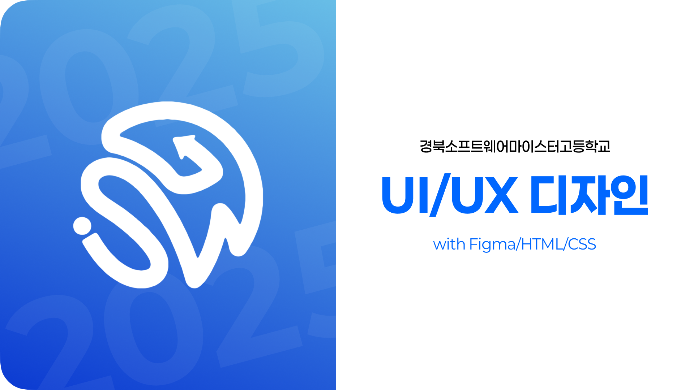
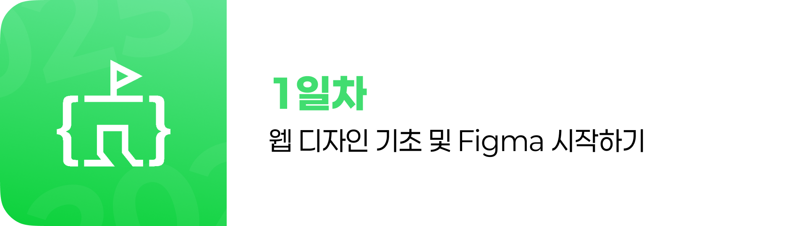
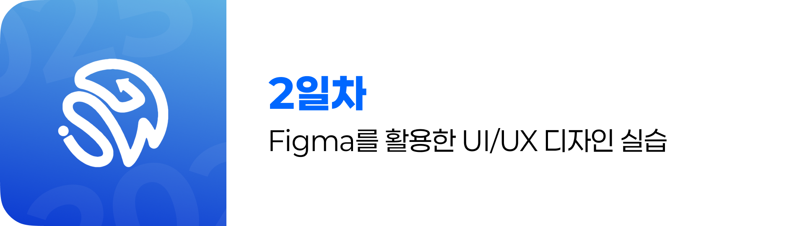
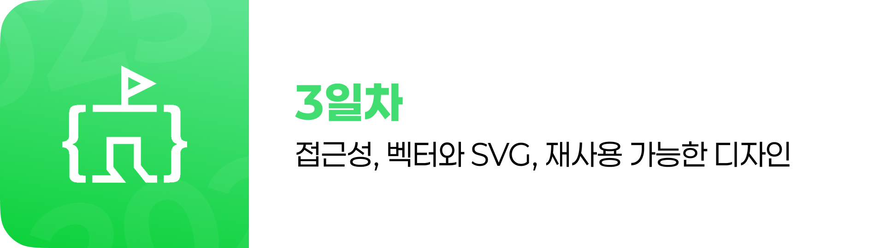
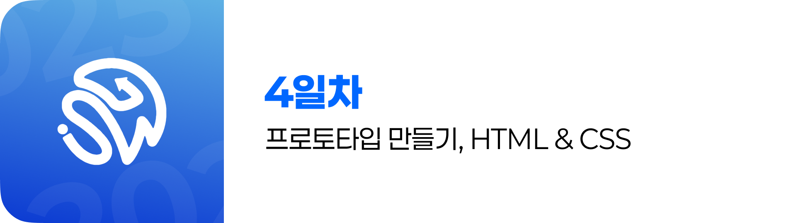

# Figma/HTML/CSS 기초 강의 문서 (Figma, HTML, CSS 실습 과정)

본 강의 자료는 '2025 경북소프트웨어마이스터고등학교 Figma/HTML/CSS' 수업을 위해 제작하였습니다.

## 목차 (Table of Contents)

### [Day 1: 웹 디자인 기초 및 Figma 시작하기](./day_1/README.md)

- [01. 웹의 이해](./day_1/01-Introducing-Web.md)
- [02. 웹 1.0과 2.0](./day_1/02-Web-1.0-2.0.md)
- [03. 프론트엔드, 백엔드, 풀스택](./day_1/03-Frontend-Backend-Fullstack.md)
- [04. 디자인 트렌드의 역사](./day_1/04-History-of-Design-Transformation.md)
- [05. UI와 UX](./day_1/05-UI-UX.md)
- [06. 피그마란?](./day_1/06-What-is-Figma.md)
- [07. 피그마 시작하기](./day_1/07-Figma-First-Step.md)
- [08. 도형과 텍스트](./day_1/08-Shape-and-Text.md)
- [09. 프레임과 그룹](./day_1/09-Frame-and-Group.md)
- [10. 실습 1: 명함 만들기](./day_1/10-Create-Business-Card.md)
- [11. 실습 2: 배너 만들기](./day_1/11-Create-Banner.md)

### [Day 2: Figma를 활용한 UI/UX 디자인 실습](./day_2/README.md)

- [01. 폰트](./day_2/01-Fonts.md)
- [02. 여백의 미](./day_2/02-The-Beauty-of-the-Blank.md)
- [03. 컬러 팔레트](./day_2/03-Color-Pallete.md)
- [04. 시각적 계층 구조](./day_2/04-Visual-Hierarchy.md)
- [05. 반응형 디자인](./day_2/05-Responsible-Design.md)
- [06. 앵커 포인트 (제약 조건)](./day_2/06-Anchor-Point.md)
- [07. 오토 레이아웃](./day_2/07-Auto-Layout.md)
- [08. 피그마 플러그인](./day_2/08-Figma-Plugins.md)
- [09. 디자인에 유용한 웹사이트](./day_2/09-Useful-Websites.md)
- [10. 실습 1: 블로그 UI 디자인](./day_2/10.%20Practice-1.md)
- [11. 실습 2: 회원가입 폼 디자인](./day_2/11.%20Practice-2.md)

### [Day 3: 접근성, 벡터와 SVG, 재사용 가능한 디자인](./day_3/README.md)

- [01. 웹 접근성](./day_3/01-Accessibility.md)
- [02. 와이어프레임](./day_3/02-Wire-Frame.md)
- [03. 벡터와 비트맵](./day_3/03-Vector-Bitmap.md)
- [04. SVG란?](./day_3/04-What-is-SVG.md)
- [05. 마스크, 유니온, 아웃라인 스트로크](./day_3/05-Mask-Union-OutlineStroke.md)
- [06. 아이콘 만들기](./day_3/06-Create-Icon.md)
- [07. 재사용 가능한 디자인](./day_3/07-Reusable-Design.md)
- [08. 전역 스타일 (컬러, 폰트)](./day_3/08-Global-Styles.md)
- [09. 자주 사용되는 UI 컴포넌트](./day_3/09-Common-UI-Components.md)
- [10. 컴포넌트 (Component)](./day_3/10-Component.md)
- [11. 컴포넌트 세트 (Component Set)](./day_3/11-Component-Set.md)
- [12. 실습 1: 리스트 컴포넌트 만들기](./day_3/12-Practice-1.md)
- [13. 실습 2: 대시보드 UI 디자인](./day_3/13-Practice-2.md)

### [Day 4: 프로토타입 만들기, HTML & CSS](./day_4/README.md)

- [01. 프로토타입과 플로우](./day_4/01-Prototype-and-Flow.md)
- [02. HTML이란?](./day_4/02-What-is-HTML.md)
- [03. CSS란?](./day_4/03-What-is-CSS.md)
- [04. Visual Studio Code](./day_4/04-Visual-Studio-Code.md)
- [05. 개발자 도구](./day_4/05-Developer-Tool.md)
- [06. Git과 GitHub](./day_4/06-GIt-GitHub.md)
- [07. 실습 1: CSS로 Auto Layout 구현하기](./day_4/07-Practice-1.md)
- [08. 실습 2: CSS 상대 위치, 절대 위치](./day_4/08-Practice-2.md)
- [09. 실습 3: 개인 프로필 카드 만들기](./day_4/09-Practice-3.md)
- [10. 실습 4: 간단한 로그인 페이지](./day_4/10-Practice-4.md)
- [11. 실습 5: Modal 창 띄우기](./day_4/11-Practice-5.md)

### [Day 5: HTML/CSS 고급 활용 1 – 반응형 웹과 변수](./XX-Still-Writing.md)

- [01. CSS 전역 변수 (Custom Properties)](./XX-Still-Writing.md)
- [02. 반응형 웹의 기본 원리 이해하기](./XX-Still-Writing.md)
- [03. @media를 활용한 해상도 대응](./XX-Still-Writing.md)
- [04. @media를 활용한 테마 설정 (prefers-color-scheme)](./XX-Still-Writing.md)
- [05. 실습 1: 반응형 카드 UI 만들기](./XX-Still-Writing.md)
- [06. 실습 2: 다크/라이트 테마 토글 만들기 (자바스크립트 X)](./XX-Still-Writing.md)

### [Day 6: HTML/CSS 고급 활용 2 – 테마와 사용자 정의 속성](./XX-Still-Writing.md)

- [01. HTML의 `data-*` 속성 이해하기](./XX-Still-Writing.md)
- [02. `data-theme`을 활용한 테마 전환](./XX-Still-Writing.md)
- [03. 다크/라이트 테마 커스터마이징 (CSS 변수 기반)](./XX-Still-Writing.md)
- [04. CSS 전환 애니메이션으로 부드러운 테마 전환](./XX-Still-Writing.md)
- [05. 실습 1: 토글 버튼으로 테마 바꾸기 (JS 포함)](./XX-Still-Writing.md)
- [06. 실습 2: 전체 사이트에 테마 적용하기](./XX-Still-Writing.md)

### [Day 7: AI를 활용한 HTML & CSS 개발 보조](./XX-Still-Writing.md)

- [01. ChatGPT를 활용한 코드 초안 작성](./XX-Still-Writing.md)
- [02. 시안 설명으로부터 코드 생성하기 (프롬프트 작성법)](./XX-Still-Writing.md)
- [03. 코드 리뷰 및 개선 요청하기 (AI를 통한 협업)](./XX-Still-Writing.md)
- [04. 실습 1: Figma 디자인을 설명하고 코드 생성 요청하기](./XX-Still-Writing.md)
- [05. 실습 2: CSS 버그를 AI와 함께 해결해보기](./XX-Still-Writing.md)

### [Day 8: 포트폴리오 사이트 디자인 및 발표](./XX-Still-Writing.md)

- [01. 나만의 포트폴리오 주제 정하기](./XX-Still-Writing.md)
- [02. Figma로 와이어프레임 및 시안 제작](./XX-Still-Writing.mdd)
- [03. HTML/CSS 기반의 정적 웹사이트 구축](./XX-Still-Writing.md)
- [04. 실습: 개별 포트폴리오 사이트 만들기](./XX-Still-Writing.md)
- [05. 발표 및 피드백](./XX-Still-Writing.mdd)
