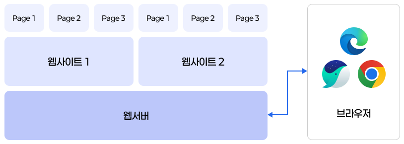

# 1. Introducing Web

> [!NOTE]
> 이 페이지에서는 Web의 작동 방식을 간단히 설명하고 Web 1.0~2.0의 역사를 설명합니다.
> 상세한 Web 설명은 [이 문서](https://github.com/haedalprogramming/practiceWeb)로 이동하여주세요.

## 1.1. 웹의 정의 및 구성 요소

> Web은 전 세계의 컴퓨터가 엮여있는 거미줄과 같다.


### Web이란?

- 전 세계적으로 연결된 Computer Network를 통해 정보를 공유하는 시스템
- 우리가 평소에 즐기는 웹사이트, 동영상 시청, 온라인 쇼핑 등은 모두 Web을 통해 이루어집니다.

## 1.2. Web의 핵심 구성 요소

> 조각이 모여 종이가 되고, 종이가 모여 책이 된다.
> 그리고 책이 모여 도서관이 형성된다.



Web은 다양한 구성요소의 조합으로 이루어져있습니다.

| 구성 요소       | 설명                                                            | 예시                    |
| --------------- | --------------------------------------------------------------- | ----------------------- |
| **웹 페이지**   | 시각적으로 제공되는 정보의 단위                                 | 뉴스 기사, 블로그 글 등 |
| **웹사이트**    | 다수의 웹 페이지로 구성된 정보 묶음                             | 네이버, 구글 등         |
| **웹 서버**     | 웹 페이지 파일을 저장하고, 브라우저 요청에 따라 전송하는 컴퓨터 | Apache, Nginx 등        |
| **웹 브라우저** | 웹 페이지 열람 및 상호작용을 위한 프로그램                      | Chrome, Edge, Safari 등 |

우리가 재료를 모아서 만들면 음식이 되고, 음식을 모으면 뷔페가 되는 것처럼 Web도 웹페이지가 모여 웹사이트가 되고, 웹사이트가 모여 인터넷을 통해 접속할 수 있는 Web 환경을 이루게 됩니다.

## 1.3. Web의 역사

### Web의 탄생

> by. Timothy John Berners-Lee - 1989

1989년, 유럽 입자 물리 연구소(CERN)에서 과학자 간 효율적인 정보 공유를 목적으로 제안된 `Hypertext` 기반의 문서 공유 시스템. WWW(World Wide Web)의 시초.

### HTML의 등장

> HyperText Markup Language

HTML은 웹 문서를 구조화하기 위한 표준 언어로 등장. 문서의 제목, 단락, 목록, 링크 등을 정의할 수 있고 `Hyperlink`를 통해 여러 HTML 문서를 연결할 수 있는 기능을 지원. (마치 거미줄처럼 연결된 문서들)

```html
<h1>문서의 제목 입력</h1>
<a href="https://www.naver.com">네이버로 이동</a>
```

### CSS의 등장

CSS(Cascading Style Sheets)은 HTML 문서의 디자인/스타일을 담당하기 위해 도입되었습니다. CSS를 통해 색상, 폰트, 레이아웃을 원하는대로 정의할 수 있었고, 이를 통해 `HTML`과 `CSS`를 분리하는 구조가 생겼습니다.

```css
/* 제목을 파란색으로, 크기는 32px */
h1 {
  color: blue;
  font-size: 32px;
}
```

### 현대 Web

> 이제 문서 공유만 목적이 아니다!

오늘날의 Web은 단순한 문서 전달을 넘어서 Interactive한 Application Platform으로 진화했습니다.

> [!NOTE]
>
> [Web 1.0/2.0](./02-Web-1.0-2.0.md)에서 상세 기술합니다.

## 1.4. 웹 작동 방식

> 이 문서에선 [URL/URI/IP](https://github.com/haedalprogramming/practiceWeb/blob/curriculum/day1/01-Introducing-to-Web.md) 등 상세 개념에 대해 설명하지 않습니다.


### (1) 주소(URL/URI) 해석

웹 브라우저를 통해 `https://naver.com`을 입력합니다.

### (2) 웹 서버 요청

웹 브라우저가 입력받은 URL을 해석합니다.

해석한 URL의 웹 서버에 웹 페이지 파일을 요청한 후 대기합니다.

### (3) 웹 서버 응답

웹 서버는 브라우저로 HTML, CSS, JavaScript 등의 파일을 응답으로 전송하고 브라우저는 이를 받습니다.

### (4) 브라우저 렌더링

> [!NOTE]
> 브라우저 렌더링과 관련한 호환성 문제는 [접근성](/day_3/01-Accessibility.md#14-브라우저에서의-접근성-및-호환성) 문서에서 기술합니다.

웹 브라우저는 웹 서버로부터 수신한 파일을 해석하여 웹 페이지를 사용자 화면에 렌더링합니다.
