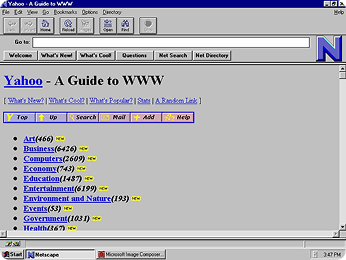
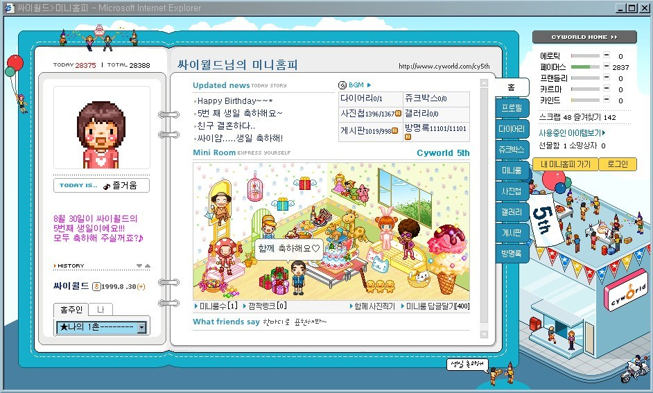

# 2. Web 1.0과 Web 2.0

> [!NOTE]
> 이 문서는 Web의 발전 과정 중 **Web 1.0과 Web 2.0**에 대해 설명합니다. Web 3.0에 대해선 기술하지 않습니다.

## 2.1. Web 1.0 (1990~2004)

> 읽기 전용(Read Only) - 정적인 정보 제공 중심

> 초창기 Yahoo 웹 사이트

### 특징

- 정적인 페이지로 구성되어 있음
- 사용자는 정보를 보기만 하고, 직접 수정할 수 없음
- 웹사이트는 **HTML**로만 구성되어 디자인과 기능이 단순함
- 디자인은 이미지 위주, 레이아웃은 Table(표) 기반이 많았음

### UI/UX 디자이너 입장으로 본 Web 1.0은?

| 항목        | 설명                                           |
| ----------- | ---------------------------------------------- |
| 디자인 특징 | 이미지 중심, 폰트 제한적, 대부분 고정 레이아웃 |
| 인터랙션    | 없음, 링크 클릭 외의 사용자 활동 없음          |
| 사용자 역할 | **단순 소비자 (Reader)**                       |

## 2.2. Web 2.0 (2004~2015 및 현재)

> 읽고 쓰기(Read-Write) - 사용자 참여 중심의 Web

> 사용자 참여가 주였던 싸이월드 홈피 (방문 및 댓글)

### 특징

- 사용자도 콘텐츠를 생성하고 공유할 수 있음 (ex. 댓글, 리뷰, SNS)
- 서버와의 실시간 데이터 교환으로 동적인 UI/UX 가능
- **HTML + CSS + JavaScript**의 조합으로 풍부한 시각 표현
- **AJAX** 기술을 통해 페이지 새로고침 없이 일부 데이터 갱신 가능

### UI/UX 디자이너 입장으로 본 Web 2.0은?

| 항목        | 설명                                                |
| ----------- | --------------------------------------------------- |
| 디자인 특징 | 반응형, 인터랙션 요소 증가, 버튼/탭/레이어 UI 도입  |
| 인터랙션    | 클릭, 드래그, 슬라이드 등 다양한 사용자 동작 지원   |
| 사용자 역할 | **참여자 (Creator)** – 댓글, 포스팅, 프로필 작성 등 |

## 2.3. Web 1.0 / 2.0 비교 요약

| 항목          | Web 1.0                    | Web 2.0                          |
| ------------- | -------------------------- | -------------------------------- |
| 사용자 역할   | 소비자(Reader)             | 참여자(Creator)                  |
| 디자인        | 정적/단순                  | 동적/인터랙션 중심               |
| 콘텐츠 생산자 | 기업/사이트 운영자         | 모두 (사용자 포함)               |
| 기술 요소     | HTML 중심                  | HTML + CSS + JS + AJAX           |
| 대표 사례     | 초기 포털, 소개형 홈페이지 | 블로그, 유튜브, SNS, 댓글 사이트 |

> [!TIP]
> Web 1.0 → Web 2.0으로의 변화는 디자이너가 사용자 흐름을 설계할 수 있는 시대의 시작이었습니다.

---

## 2.4. 이후는?

현재는 Web 3.0이라는 개념이 논의되고 있으며,
AI, 블록체인, 개인 데이터 중심의 차세대 Web으로의 진화를 시도 중입니다.

하지만 Web 2.0은 여전히 현대 디자인의 기반입니다.
