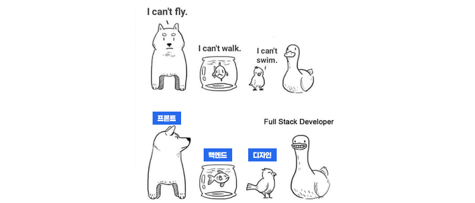

# 3. Web 개발자 역할 이해

> [!NOTE]
> 이 문서는 Web 개발 분야에서 자주 언급되는 **프론트엔드, 백엔드, 풀스택**의 역할과 차이점을 설명합니다.
> UI/UX 디자이너가 개발자와 협업할 때 기본적인 이해를 돕기 위한 내용입니다.

## 3.1. 프론트엔드 (Frontend)

> 사용자가 직접 볼 수 있는 화면을 만드는 개발자

### 정의

- **웹사이트에서 사용자에게 보이는 부분**을 개발하는 역할
- HTML, CSS, JavaScript를 활용하여 웹 페이지의 디자인과 Interaction(상호작용)을 구현합니다.
- 디자이너가 구상한 시안을 실제 웹 화면으로 만드는 사람이기도 합니다.

### 주요 기술

- HTML, CSS, JavaScript
- React, Vue, Svelte 등 SPA\* 프레임워크

  
<strong>Question</strong>

  
SPA가 무엇일까요?

### 디자이너와의 연결

| 항목             | 설명                                                |
| ---------------- | --------------------------------------------------- |
| 작업물 연계      | Figma → HTML/CSS 구조와 스타일로 변환               |
| 중요 협업 포인트 | 레이아웃, 색상, 폰트, 컴포넌트 구조, 반응형 고려 등 |
| 대표 예시        | 네이버 홈 화면, 게시판 목록, 로그인 화면 등         |

---

## 3.2. 백엔드 (Backend)

> 사용자 눈에는 보이지 않지만 시스템의 핵심을 담당

### 정의

- 웹사이트의 **서버, 데이터베이스, API** 등을 개발하는 역할
- 로그인 정보 저장, 게시글 목록 처리, 결제 로직 등 **기능적인 로직**을 담당
- 프론트엔드에서 요청한 데이터를 받아 처리하고 응답함

### 주요 기술

- 서버 언어: Python, Node.js, Java, PHP 등
- 데이터베이스: MySQL, MongoDB, PostgreSQL 등
- API 설계, 인증 처리, 보안 등

  
<strong>Question</strong>

  
API가 무엇일까요?

### 디자이너와의 연결

| 항목             | 설명                                                 |
| ---------------- | ---------------------------------------------------- |
| 작업물 연계      | 프론트엔드와 연결되는 API를 설계                     |
| 중요 협업 포인트 | 어떤 데이터를 어떻게 받아올지, 데이터 형식 정리 필요 |
| 대표 예시        | 회원가입 처리, 댓글 저장, 상품 정보 조회 등          |

---

## 3.3. 풀스택 (Fullstack)

> 프론트엔드와 백엔드를 모두 이해하고 개발하는 전천후 개발자

### 정의

- **프론트엔드 + 백엔드 역할을 모두 수행**할 수 있는 개발자
- 혼자서 웹사이트 전체를 만들 수 있으며, 스타트업이나 소규모 프로젝트에서 자주 필요

### 주요 기술

- 프론트엔드: HTML, CSS, JavaScript, React 등
- 백엔드: Node.js, Express, Django 등
- 전체 흐름을 이해하고 연결할 수 있는 능력 필요

### 디자이너와의 연결

| 항목             | 설명                                                 |
| ---------------- | ---------------------------------------------------- |
| 작업물 연계      | 디자인 구현부터 기능 연결까지 한 명이 모두 수행 가능 |
| 중요 협업 포인트 | 디자인과 기능 사이에서 일관된 사용자 경험 설계 가능  |
| 대표 예시        | 개인 프로젝트, 스타트업 초기 웹 서비스 등            |

---

## 3.4. 비교 요약

| 구분          | 프론트엔드                         | 백엔드                 | 풀스택                                  |
| ------------- | ---------------------------------- | ---------------------- | --------------------------------------- |
| 위치          | 사용자 화면                        | 서버, 데이터           | 둘 다                                   |
| 디자이너 연관 | 시각 요소 구현, 레이아웃, 인터랙션 | 데이터 처리, 기능 연결 | 디자인 반영부터 기능 구현까지 모두 담당 |

> [!TIP]
> 프론트엔드 개발자는 디자이너와 가장 밀접하게 협업하며,  
> 서로의 언어(단위, 컴포넌트, 반응형 등)를 조금씩 이해하면 더 좋은 결과를 만들 수 있습니다.
>
> UI/UX 디자이너가 코딩도 할 수 있으면 더 좋겠죠?
