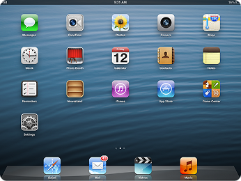
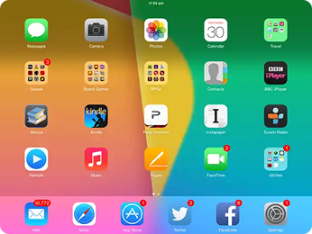
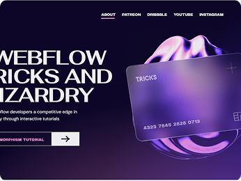

# 4. 디자인 유행

> [!NOTE]
> 이 문서에서는 Web 디자인 트렌드의 역사적 흐름을 소개합니다.  
> 디자인 스타일의 변화는 기술 발전, 사용자 기대, 기기 환경의 변화에 따라 달라졌습니다.

## 4.1. 1990s~2000s: 정적 디자인 (Static Design)

> 초창기 Yahoo 웹 사이트

- Web 1.0 시대의 디자인
- HTML 중심의 정적인 페이지 위주.
- 이미지와 텍스트 위주로 구성되었으며, 색상과 폰트의 선택폭이 좁았음.
- 정보 전달이 가장 중요한 목적이었고, **PC 환경에 최적화**된 고정형(Fixed) 레이아웃이 사용됨.

  
<strong>Question</strong>

  
색상과 폰트의 선택폭이 좁았던 이유는 무엇일까요?

## 4.2. 2000s~2010s: 스큐어모피즘 (Skeuomorphism)

> 초창기 iPad의 홈 UI

- 현실을 모방한 시각 표현 방식.
- Web 2.0 시대와 함께 인터랙션과 CSS/JavaScript의 활용이 늘어남.
- 버튼, 카드, 아이콘 등을 **실제처럼 보이게 디자인**하는 스타일이 유행.
- 사용자 친화적인 느낌을 주기 위해 입체감, 그라데이션, 그림자 등이 많이 사용됨.

## 4.3. 2010s~2016s: 미니멀리즘 (Minimalism)

> 초창기 iPad의 홈 UI

- 스큐어모피즘의 복잡함을 지양하고 **단순한 형태, 색상, 아이콘 중심의 디자인**으로 전환.
- Apple iOS 7과 Google Material Design이 대표적.
- 정보의 우선순위와 구조에 집중하며, 빠른 로딩과 가독성 향상을 목표로 함.
- 모바일 환경에 적합한 반응형(Responsible) 디자인이 유행 시작.

## 4.3. 2016s ~ 현재: 네오모피즘 & 글래스모피즘, 감성적인 디자인

> 유리같은 재질에 뒷배경이 Blur 처리된 디자인

- 미니멀리즘과 스큐어모피즘의 중간 지점.
- 은은한 그림자와 음영을 활용하는 네오모피즘, 반투명한 유리질 느낌의 글래스모피즘 등 새로운 시각 스타일 등장.
- 다크 모드, 스크롤 애니메이션, 3D 인터랙션 등 **사용자 맞춤형 경험과 감성적 UI**가 강조됨.
- 접근성과 브랜드 아이덴티티를 함께 고려하는 디자인이 중요해짐.

  
<strong>Question 1</strong>

  
Windows 또는 Mac에서 사용하는 디자인은 무엇일까요?

 

  
<strong>Question 2</strong>

  
Google, Apple, Samsung에서 사용하는 디자인을 찾아볼까요?

## Appendix. 앞으로의 웹 디자인 트렌드

> [!NOTE]
> 연관된 예시를 [접근성](/XX-Still-Writing.md) 문서에서 상세히 기술합니다.

- **반응형 웹 디자인 (Responsive Web Design):** 다양한 디바이스 크기에 따라 자동으로 레이아웃이 조정되는 디자인 방식입니다.
- **모바일 퍼스트 (Mobile First):** 모바일 사용자가 늘어나면서, 디자인을 모바일 중심으로 먼저 설계한 후 PC로 확장하는 전략입니다.
- **다크 모드 (Dark Mode):** 눈의 피로를 줄이고 사용자의 취향을 반영할 수 있는 어두운 배경 기반 디자인입니다.
- **미니멀리즘 (Minimalism):** 복잡한 요소 없이 단순하고 명료한 화면을 추구합니다. 사용자 집중도를 높일 수 있습니다.
- **일러스트레이션 및 애니메이션:** 브랜드 개성을 강조하고, 사용자의 즐거움을 유도하기 위한 시각적 표현 방식입니다. SVG, Lottie 등의 기술로 구현됩니다.
