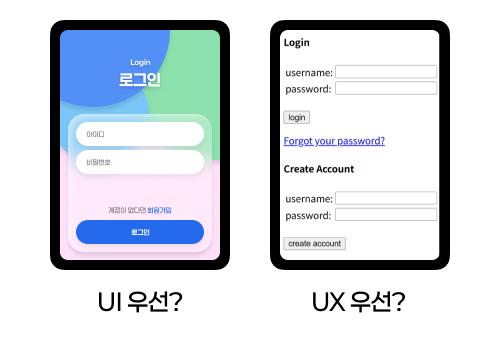

# 5. UI/UX 개념과 좋은 UX vs 나쁜 UX

> [!NOTE]  
> 이 문서에서는 **UI와 UX의 정의, 차이점, 그리고 실제 예시**를 통해 좋은 UX와 나쁜 UX를 구분하는 법을 설명합니다.  
> 디자이너가 사용자 입장에서 생각하는 법을 배우는 데 중점을 둡니다.

## 5.1. UI (User Interface)

> 사용자와 제품이 만나는 시각적 접점

- **정의:** 사용자가 웹사이트나 앱을 사용할 때 **직접 눈으로 보는 요소들**  
  (버튼, 메뉴, 폰트, 색상, 여백, 레이아웃 등)
- **목표:** **빠르고 직관적인 조작**을 도와 사용자의 행동을 유도하는 것
- **예시:**
  - 회원가입 버튼의 색상과 위치
  - 메뉴바가 상단에 고정되어 있음
  - 입력창의 상태 변화(선택 시 강조)

> [!TIP]
> 잘 설계된 UI는 사용자가 길을 잃지 않고 원하는 행동을 하게 만듭니다.

## 5.2. UX (User Experience)

> 제품을 사용하는 전체 과정에서의 느낌과 경험

- **정의:** 사용자가 제품을 사용하면서 **겪는 전반적인 감정과 인상**  
  (기대, 사용 흐름, 만족감, 문제 해결 등 포함)
- **목표:** 편리하고, 즐겁고, 다시 사용하고 싶은 경험을 만드는 것
- **예시:**
  - 회원가입이 너무 복잡하거나 중간에 끊기지 않도록 구성
  - 오류 메시지가 친절하고 해결 방법을 알려줌
  - 구매/예약 과정이 3단계 이내로 마무리됨

> [!TIP]
> UX는 단순히 '보기 좋다'가 아니라 '사용했을 때 기분이 좋다'입니다.

## 5.3. UI와 UX의 관계

- UI는 **UX의 일부**입니다. 좋은 UI는 UX를 향상시키는 중요한 도구입니다.
- 하지만 UI가 아무리 예뻐도, UX가 불편하면 사용자는 떠납니다.
- **비유:**
  - UI = 음식의 플레이팅
  - UX = 음식의 맛과 먹는 경험  
    → "보기 좋고 먹기 편해야 자주 찾는다."

> [!TIP]
> 물론 음식의 겉모습(UX)보다 맛(UX)이 중요하겠지만 모양도 예뻐야 맛을 보고 싶겠죠?

## 5.4. 좋은 UX vs 나쁜 UX

### 좋은 UX 예시

| 상황                    | 설명                                                                 |
| ----------------------- | -------------------------------------------------------------------- |
| 회원가입이 3단계 이내   | 불필요한 정보 없이 빠르게 가입 가능                                  |
| 버튼이 한눈에 잘 보임   | 주요 기능으로 쉽게 유도 가능, 색 대비와 위치 고려됨                  |
| 오류 메시지가 친절함    | "비밀번호가 너무 짧습니다 (최소 8자 이상)" → 해결 방법이 함께 제공됨 |
| 모바일에서도 자연스러움 | 반응형 디자인으로 기기마다 사용 흐름이 깨지지 않음                   |

> [!TIP]
> 사용자는 '좋은 UX'일 때 아무 말도 하지 않고 계속 사용합니다.

### 나쁜 UX 예시

| 상황                           | 설명                                                         |
| ------------------------------ | ------------------------------------------------------------ |
| 버튼이 너무 작거나 찾기 힘듦   | 손가락이 눌러지지 않거나, 사용자가 혼란을 느끼게 됨          |
| 회원가입 중 강제 로그아웃 발생 | 작성한 내용이 사라지고 재작성해야 하는 경우 큰 스트레스 유발 |
| 로딩이 오래 걸리고 안내 없음   | 기다리는 중에 사용자가 떠나게 됨                             |
| 모바일에서 UI가 깨짐           | 레이아웃이 겹치거나 버튼이 안 눌림                           |

> [!TIP]
> 사용자 불만, 이탈, 부정적 리뷰는 대부분 **나쁜 UX**에서 시작됩니다.

  
<strong>Question</strong>

  
직접 경험한 나쁜 UX가 있나요?

## 5.5. UI/UX의 중요성

- **사용자 만족도 향상** → "기분 좋게 쓸 수 있는 제품"
- **재방문율, 전환율 증가** → "다시 사용하고 싶은 서비스"
- **브랜드 신뢰도 개선** → "전문적이고 신뢰감 있는 인상"
- **경쟁력 확보** → "비슷한 서비스 중 더 나은 경험을 주는 곳이 선택됨"

## 5.6. Figma에서 UI/UX 고려하기

> [!NOTE]
> 프로토타입은 [Flow 개발](/XX-Still-Writing.md) 문서에서 기술합니다.

- 버튼의 **색상, 간격, 상태**를 직접 시뮬레이션 가능
- 사용 흐름(Flow)을 **프로토타입**으로 연결해볼 수 있음
- 모바일/데스크탑 버전의 UI를 동시에 설계하며 **UX 문제를 사전 파악** 가능

> 🎯 **좋은 UI/UX는 디자인이 아니라 사용자에 대한 이해로부터 시작됩니다.**
