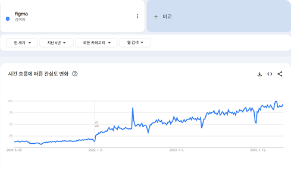

# 6. Figma 소개

- Figma는 웹 기반의 UI(사용자 인터페이스) 및 UX(사용자 경험) 디자인 툴입니다.
- 웹 브라우저에서 직접 작업할 수 있고 **실시간 협업**이 가능하다는 점이 가장 큰 장점입니다.
- 웹이 아닌 설치 버전도 있습니다.

## 6.1. Figma의 핵심 특징

| 항목                      | 설명                                                                        |
| ------------------------- | --------------------------------------------------------------------------- |
| **웹 기반**               | 설치 없이 브라우저에서 실행, 언제 어디서나 접근 가능                        |
| **실시간 협업**           | 여러 명이 동시에 하나의 디자인 파일을 열고 실시간 수정 가능                 |
| **디자인 전 과정 지원**   | 와이어프레임 → 목업 → 프로토타입 → 개발 공유까지 전 과정 지원               |
| **컴포넌트 시스템**       | 버튼, 아이콘, 카드 등을 재사용 가능한 컴포넌트로 관리하여 생산성 향상       |
| **버전 관리 및 히스토리** | 모든 변경 사항이 자동 저장되며 히스토리를 통해 언제든지 이전 상태 복원 가능 |

## 6.2. Figma에서 가능한 작업

- **와이어프레임:** 아이디어를 빠르게 시각화하는 스케치
- **UI 디자인:** 버튼, 입력창, 메뉴 등 사용자 인터페이스 구성
- **UX 흐름 설계:** 사용자가 어떤 순서로 서비스를 이용하게 될지 플로우 구성
- **프로토타입 제작:** 실제처럼 클릭 가능한 시제품 제작
- **개발자 공유:** 코드 없이도 디자인 사양서(폰트, 색상, 여백 등)를 개발자에게 전달

## 6.3. 개발자에게 Figma가 중요한 이유

| 항목                     | 설명                                                               |
| ------------------------ | ------------------------------------------------------------------ |
| **디자이너와의 소통**    | 픽셀 단위까지 정해진 디자인 기준을 정확히 파악 가능                |
| **협업 효율성 향상**     | 디자이너와 실시간 의견 교환 및 빠른 피드백으로 개발 시간 단축      |
| **프로토타입 기반 개발** | 디자이너가 만든 프로토타입을 참고하여 실제 화면을 코드로 구현 가능 |
| **디자인 시스템 활용**   | 반복 요소를 컴포넌트화해 일관된 UI 구현 가능                       |

> [!TIP]
> 팀 프로젝트 시, Figma는 개발자와 디자이너를 **이어주는 다리 역할**을 합니다.  
> 디자인 확인용 PDF보다 더 직관적이고, 실시간으로 수정사항을 반영할 수 있어 커뮤니케이션이 매우 효율적입니다.

## 6.4. Figma 무료 플랜

> 2025년 7월 기준

| 플랜 구분        | 설명                                                            |
| ---------------- | --------------------------------------------------------------- |
| **Free**         | 3개의 프로젝트, 무제한 파일 생성 가능. 개인 사용 및 학습용 적합 |
| **Professional** | 팀 기반 협업을 위한 기능 포함. 유료                             |
| **Education**    | 학생/교사 인증 시 무료로 프로페셔널 기능 제공                   |

## 6.5. 실무 활용 사례

- 스타트업 UI 디자인 및 프로토타입 제작
- UX 리서치 기반 사용자 흐름 설계
- 쇼핑몰/앱 디자인 → 프론트 개발자와 실시간 공유
- 코드 구현 전 테스트용 인터랙션 설계

> [!NOTE]
> 실제 업무에서 디자이너가 만든 Figma 파일은 개발자의 **설계도**입니다.  
> 코드로 구현하기 전 반드시 Figma에서 구조와 흐름을 충분히 이해하는 것이 중요합니다.
