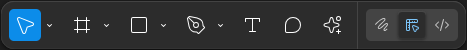

# 7.1. Figma 회원가입 및 설치

> [!NOTE]  
> 이 문서에서는 Figma에 처음 입문하는 학생들을 위해 **회원가입 방법**과 **프로그램 설치 과정**,  
> 그리고 **작업 파일을 생성하고 UI를 이해하는 단계**까지 다룹니다.

## 7.1.1. Figma 웹사이트 접속 및 회원가입

| 항목              | 설명                                                                      |
| ----------------- | ------------------------------------------------------------------------- |
| **Figma 접속**    | 웹사이트 주소: `https://www.figma.com`                                    |
| **회원가입 방법** | Google 계정으로 로그인 (권장) 또는 이메일/비밀번호로 직접 가입 가능       |
| **주의사항**      | 실습에 앞서 계정을 미리 생성해오는 것을 권장하나, 현장에서 가입 시간 제공 |

> [!TIP]  
> 다음부터 수업 시작 전, 인터넷이 되는 노트북 또는 PC에서 Figma 로그인 상태를 미리 유지해두면 원활한 실습이 가능합니다.

## 7.1.2. 데스크톱 앱 설치 (선택 사항이지만 권장)

| 항목                   | 설명                                                                                     |
| ---------------------- | ---------------------------------------------------------------------------------------- |
| **웹 버전**            | 설치 없이 Chrome, Edge 등 웹 브라우저에서 바로 사용 가능                                 |
| **데스크톱 앱 (권장)** | 폰트 적용, 드래그 퍼포먼스 등에서 안정적. `Downloads` 또는 `Help` 메뉴에서 다운로드 가능 |

## 7.1.3. 새 디자인 파일 생성

1. Figma 로그인 후 대시보드에서 `New design file` 클릭
2. 혹은 `Drafts > + Design file` 클릭
3. 파일 이름은 `2일차_기본도형실습` 등으로 통일
4. 파일은 자동 저장되며, `Untitled` 영역 클릭 시 이름 수정 가능

# 7.2. Figma 작업 화면 구성

> [!NOTE]  
> Figma는 Adobe 툴과 유사한 인터페이스 구조를 가지고 있어, 디자이너나 개발자 모두 쉽게 적응할 수 있습니다.

## 7.2.1. 주요 인터페이스 구성

| 번호 | 이름           | 설명                                                                 |
| ---- | -------------- | -------------------------------------------------------------------- |
| 1    | **하단 툴바**  | 기본 도구(Move, Frame, 도형 등), 모드 전환 (Design/Prototype/Code)   |
| 2    | **Draft 메뉴** | 파일 이름 수정, 저장, 메뉴 열기 (창문 아이콘 클릭 시 UI 표시/숨김)   |
| 3    | **탭 영역**    | 열린 파일 간 이동, `Home` 및 `Draft` 탭 형태로 구성                  |
| 4    | **Page 관리**  | 작업 공간 추가/삭제/이동 가능. 하나의 파일에서 여러 Page를 구성 가능 |
| 5    | **Layer 구조** | 모든 오브젝트의 계층 구조를 보여줌. 포토샵/일러스트의 레이어와 유사  |
| 6    | **Share/Play** | 파일 공유, 프로토타입 재생, 실시간 편집자 정보 확인 가능             |
| 7    | **속성창**     | 선택한 오브젝트의 위치, 크기, 색상, 테두리 등 속성 설정              |
| 8    | **Canvas**     | 실제 작업이 이루어지는 도화지 같은 공간                              |

## 7.2.2. 하단 툴바 주요 도구

| 도구           | 단축키 | 설명                                               |
| -------------- | ------ | -------------------------------------------------- |
| **Move Tool**  | `V`    | 오브젝트를 선택하거나 이동할 때 사용               |
| **Frame Tool** | `F`    | 화면(Frame) 영역 생성. 모바일/PC 등 크기 지정 가능 |
| **Rectangle**  | `R`    | 사각형 도형 생성                                   |
| **Line**       | `L`    | 선 도형 생성                                       |
| **Ellipse**    | `O`    | 원형 도형 생성                                     |

> [!TIP]  
> Figma의 모든 도구는 키보드 단축키를 통해 빠르게 접근할 수 있습니다.  
> 자주 사용하는 `V`, `F`, `R`는 미리 익혀두면 실습 속도가 빨라집니다.

# 7.3. Figma 환경 요약

- **Canvas는 무제한 공간**으로, Page를 나누고 Frame 단위로 UI 구성 가능
- **Layer와 속성 패널은 좌우에 고정되어** 항상 오브젝트를 관리하기 쉬움
- **인터페이스가 단순하고 직관적이기 때문에** 초보자도 금방 적응 가능
