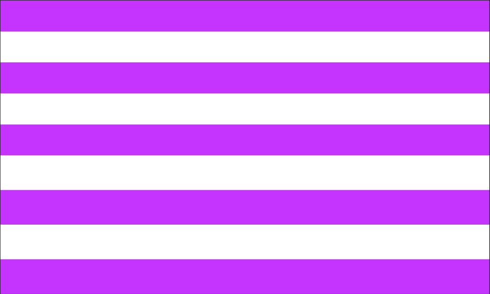
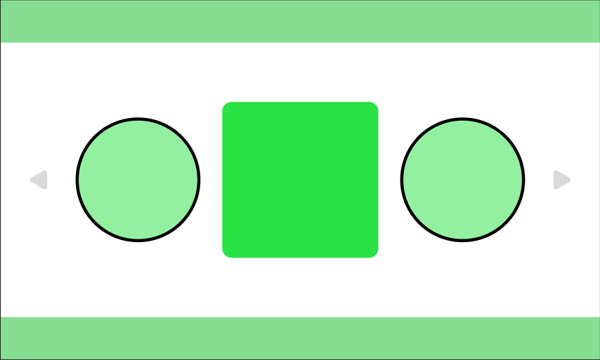
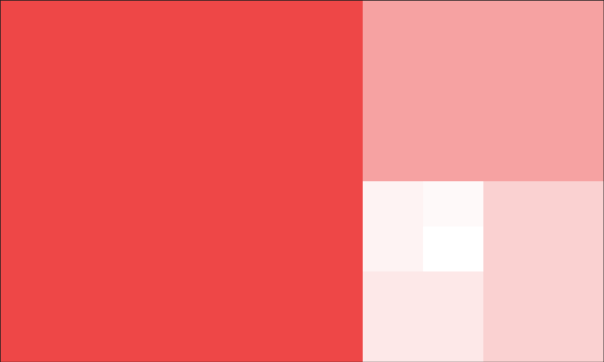
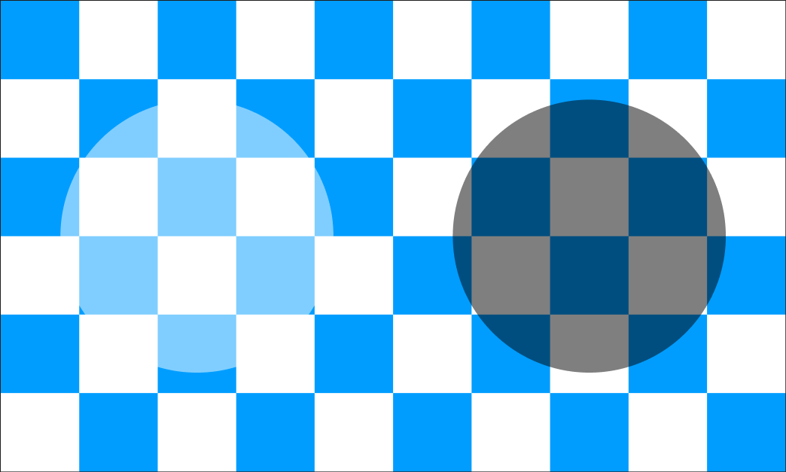
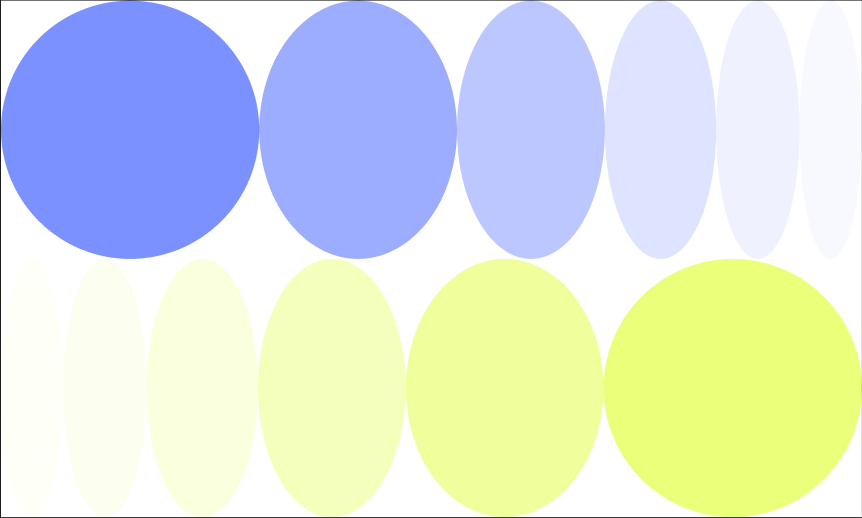
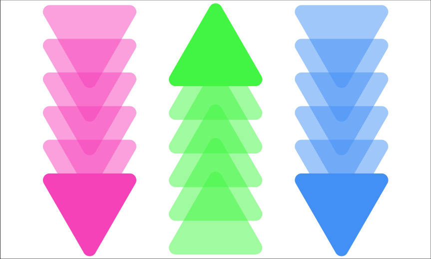
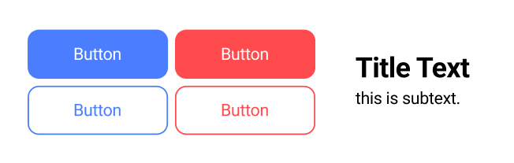

# 8. 도형과 텍스트 사용법

> [!NOTE]
> 이 단원에서는 Figma의 가장 기본적인 오브젝트인 **도형(Shape)**과 **텍스트(Text)**를 다룹니다.  
> UI 디자인에서 자주 쓰이는 시각적 요소의 기반이므로 충분히 연습해보는 것이 중요합니다.

## 8.1. 도형 (Shape) 사용법

### 8.1.1. 도형 도구 소개

| 도형 종류     | 단축키 | 설명                                          |
| ------------- | ------ | --------------------------------------------- |
| **Rectangle** | `R`    | 사각형. 버튼, 카드 등의 기본 형태로 많이 사용 |
| **Ellipse**   | `O`    | 원형. 아이콘, 토글 등 UI 요소에 활용          |
| **Line**      | `L`    | 직선. 구분선, 장식 등에 사용                  |
| **Polygon**   | `△`    | 삼각형, 오각형 등 다각형                      |
| **Star**      | ★      | 별 모양 도형                                  |

> 상단 메뉴의 `도형 아이콘` 클릭하거나 단축키 사용으로 생성 가능

### 8.1.2. 도형 만들기 및 조작

- 캔버스에서 드래그하여 도형 생성
- `Shift` 키 누른 채 드래그 → 정비율 (정사각형, 원 등)
- `Alt/Option` 키 → 중심을 기준으로 확장
- `Ctrl/Cmd + D` → 같은 간격으로 반복 복사

### 8.1.3. 도형 속성 변경 (우측 패널)

| 항목              | 설명                                                     |
| ----------------- | -------------------------------------------------------- |
| **Fill**          | 도형의 내부 색상. HEX 코드 입력 또는 팔레트 선택         |
| **Stroke**        | 테두리. 색상, 두께, 스타일 (실선, 점선 등) 설정 가능     |
| **Corner Radius** | 사각형 모서리 둥글기 설정. 네 개 모서리를 개별 조정 가능 |
| **Effects**       | 그림자(Drop Shadow), 블러(Blur) 등 시각적 효과 추가      |
| **Opacity**       | 불투명도 조절 (0% = 완전 투명, 100% = 완전 불투명)       |

### 8.1.4. 도형 실습 예시

> 같이 만들어봐요

  
  

  
  

  
  

## 8.2. 텍스트 (Text) 사용법

### 8.2.1. 텍스트 도구 소개

| 항목            | 설명                                                                     |
| --------------- | ------------------------------------------------------------------------ |
| **도구 선택**   | 상단 메뉴의 `Text (T)` 아이콘 또는 `T` 키로 빠르게 텍스트 추가           |
| **입력 방법**   | 캔버스 클릭 후 텍스트 입력. 또는 드래그하여 고정 너비 텍스트 박스 생성   |
| **기본 단축키** | `Ctrl/Cmd + B` (굵게), `Ctrl/Cmd + I` (기울임), `Ctrl/Cmd + U` (밑줄) 등 |

### 8.2.2. 텍스트 속성 설정 (우측 패널)

| 항목               | 설명                                              |
| ------------------ | ------------------------------------------------- |
| **Font**           | 폰트 종류 선택 (Figma 기본 폰트 또는 시스템 폰트) |
| **Size**           | 글자 크기 설정 (pt 단위)                          |
| **Line Height**    | 줄 간격 설정. ‘Auto’ 또는 수동 입력 가능          |
| **Letter Spacing** | 자간(글자 간 거리) 설정                           |
| **Alignment**      | 좌측, 중앙, 우측 정렬 및 상하 정렬                |
| **Fill**           | 텍스트 색상 설정                                  |
| **Opacity**        | 투명도 조절                                       |

> [!TIP]  
> 텍스트는 UI에서 버튼, 제목, 설명 등 **정보 전달의 핵심 수단**이므로 크기와 간격 설정이 매우 중요합니다.

### 8.2.3. 텍스트 실습 예시

- 공통 텍스트 폰트: `Roboto`
- 버튼 크기: `200px * 70px`
- 버튼 텍스트 크기: `24px`
- 파란색: `#4b7eff`
- 빨간색: `#ff4b4e`
- Stroke: `2px`
- 제목 텍스트 크기: `40px - Bold`
- 설명 텍스트 크기: `24px - Regular`

## 8.3. 정리

| 요소   | 핵심 요약                                                                    |
| ------ | ---------------------------------------------------------------------------- |
| 도형   | UI의 시각적 구성 요소. 버튼, 카드, 배경 등 대부분의 UI는 도형으로 시작됨     |
| 텍스트 | 사용자에게 정보를 전달하는 가장 기본적인 수단. 명확하고 직관적인 디자인 필요 |

> [!TIP]
> 디자인을 구성할 때는 텍스트와 도형의 **정렬**과 **간격**도 매우 중요합니다.
