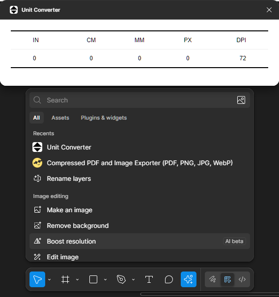
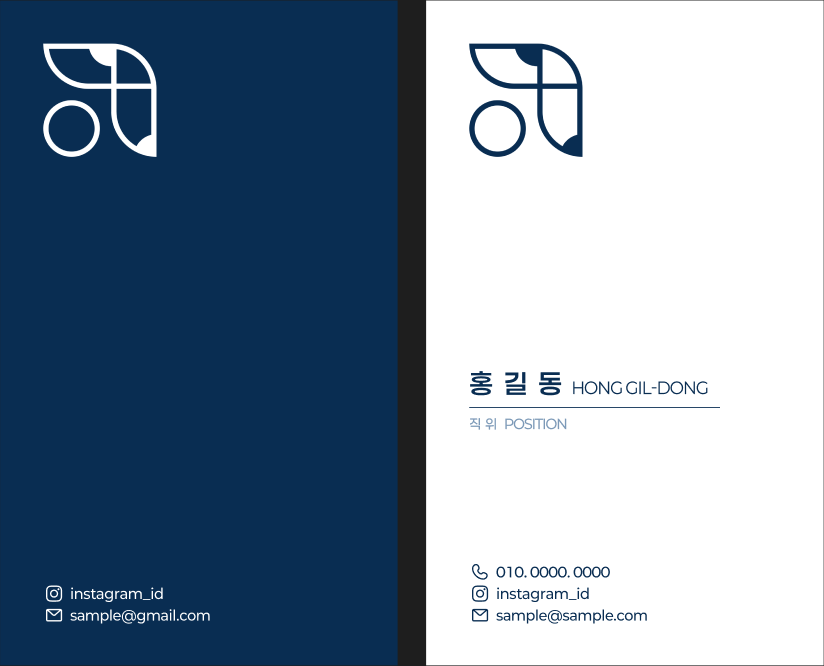
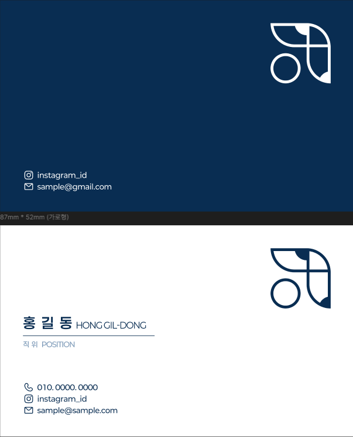

# 10. 명함 만들기

> [!NOTE]
> 이 문서에서는 본인의 명함을 제작하는 실습을 진행합니다.

## 10.1. 명함에 들어가야 할 요소들

> [!TIP]  
> 항상 어떠한 디자인을 진행하기 전, **어떤 정보가 들어가야 하며**, **무엇을 강조할 것인지** 먼저 생각해야 합니다!
>
> 그렇다고 한눈에 보이는 정보가 많다고 꼭 좋은 것은 아닙니다. 상황에 따라 **간결하면서도 본인을 가장 잘 표현하는 요소** 중심으로 구성해보세요.

**일반적으로 명함에는 아래 요소들이 포함됩니다:**

| 항목               | 설명                                                                 |
| ------------------ | -------------------------------------------------------------------- |
| **이름**           | 명함의 가장 중요한 요소. 명확하고 크게 표시해야 합니다.              |
| **직책/소속**      | 소속된 회사, 학교, 팀 또는 맡은 역할 등을 간결히 표기합니다.         |
| **연락처**         | 이메일, 휴대폰 번호 등 연락 가능한 수단을 포함합니다.                |
| **웹 주소**        | 개인 웹사이트, 포트폴리오, 소셜미디어 링크 등을 추가할 수 있습니다.  |
| **로고/아이콘**    | 회사나 팀 로고 또는 본인을 상징하는 시각적 요소를 포함하면 좋습니다. |
| **QR 코드 (선택)** | 디지털 포트폴리오나 인스타그램 등으로 연결되는 QR 코드 추가 가능.    |

## 10.2. 명함 기본 사이즈와 프레임 설정

> [!NOTE]  
> 실제 명함 인쇄 사이즈는 **가로 90mm x 세로 50mm** 또는 **가로 85mm x 세로 55mm**가 일반적입니다.

- **Plugin 사용**: 하단 툴바에서 별모양을 누른 뒤 `Plugin & widget`에서 `unit converter`를 찾아 설치
- **단위 변경:**  
  Figma 우측 속성창에서 단위를 `px` → `mm`로 변경 (또는 1px = 1pt로 가정하여 작업해도 무방).
- **프레임 만들기:**  
  Frame Tool (`F`)을 사용하여 명함 사이즈 프레임을 생성  
  → 예: `W: 90mm`, `H: 50mm`

## 10.3. 디자인 실습 단계

### (1) 정보 구성하기

> [!NOTE]  
> 계층 구조는 [이 문서](/day_2/04-Visual-Hierarchy.md)에서 상세 기술합니다.

- 넣을 정보를 텍스트 도구(`T`)를 활용해 정리합니다.
- 계층 구조 고려: **이름**을 가장 크게, 그 외 정보는 작게 배치

### (2) 도형/아이콘 추가

- 로고나 배경을 꾸밀 `Rectangle`, `Ellipse` 등의 도형을 사용
- 아이콘은 Figma의 `Plugins → Iconify`, `Feather Icons` 등에서 검색 후 삽입

### (3) 색상 및 폰트 설정

- Figma의 속성창에서 `Fill`, `Font`, `Size`, `Spacing` 등을 조절하여 시각적 밸런스를 맞춤
- 본인만의 브랜드 컬러가 있다면 적용

### (4) 정렬 및 정돈

- `Align` 도구를 활용해 텍스트와 도형들을 정렬
- `Group(Ctrl/Cmd + G)` 또는 `Frame(F)`을 활용하여 구조적으로 정리

## 10.4. 예시

## 10.5. 마무리 및 공유

- 디자인이 완성되면 **`File → Export`** 를 통해 PNG 또는 PDF로 저장
- 실습 시간에 서로의 명함을 발표하고 피드백 받는 시간을 가집니다.

> [!TIP]  
> 명함은 단순한 정보 전달이 아니라 **당신의 첫인상을 전달하는 디자인**입니다.  
> 본인의 성격, 직업, 정체성을 담을 수 있도록 개성 있게 구성해보세요!
