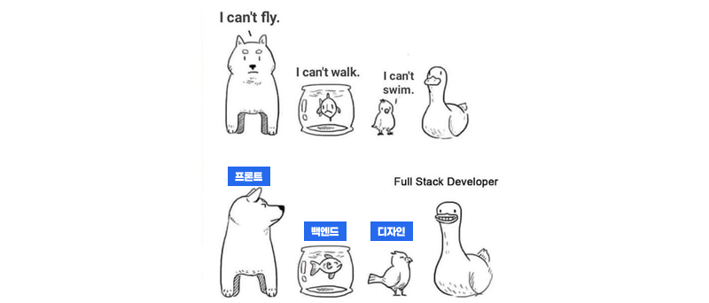
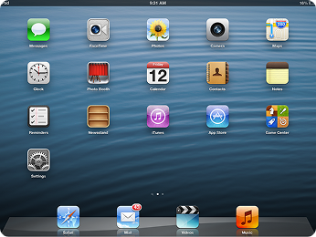
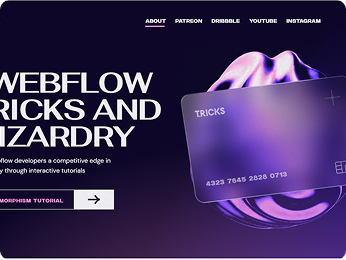

---

## 목차

- [1교시: 웹 디자인 기초 및 Figma 시작하기](#1교시-웹-디자인-기초-및-figma-시작하기)
- [2교시: Figma 기본 인터페이스 익히기](#2교시-figma-기본-인터페이스-익히기)
- [3교시: 프레임,-그룹,-텍스트-및-이미지-다루기](#3교시-프레임-그룹-텍스트-및-이미지-다루기)
- [4교시: 색상,-그라디언트-및-간단한-와이어프레임-실습](#4교시-색상-그라디언트-및-간단한-와이어프레임-실습)
- [5교시: Git/GitHub 초기 설정 및 결과물 업로드](#5교시-gitgithub-초기-설정-및-결과물-업로드)

---

## 1교시: 웹 디자인 기초 및 Figma 시작하기

> [목차로 돌아가기](#목차)

### 1. 웹 디자인의 이해

#### 1.1. 웹의 정의 및 구성 요소

웹은 전 세계적으로 연결된 컴퓨터 네트워크를 통해 정보를 공유하는 시스템으로, 웹사이트, 동영상 시청, 온라인 쇼핑 등은 모두 웹을 통해 이루어집니다.

**핵심 구성 요소:**


- **웹 페이지 (Web Page):** 시각적으로 제공되는 정보의 단위.
- **웹사이트 (Website):** 다수의 웹 페이지로 구성된 정보 묶음.
- **웹 브라우저 (Web Browser):** 웹 페이지 열람 및 상호작용을 위한 프로그램 (예: Chrome, Edge, Safari).
- **웹 서버 (Web Server):** 웹 페이지 파일을 저장하고, 브라우저 요청에 따라 전송하는 컴퓨터.

#### 1.2. 웹의 역사

- **탄생 (1989년, 팀 버너스리):** CERN에서 과학자 간 정보 공유를 목적으로 시작된 텍스트 기반 문서 공유 시스템.
- **HTML의 등장:** 웹 문서 구조화 및 하이퍼링크를 통한 문서 연결 기능이 추가되며 웹의 폭발적 성장을 견인.
- **CSS의 등장:** 웹 페이지 디자인(색상, 레이아웃 등)을 담당하며 내용과 디자인을 분리하여 효율적인 웹 개발 환경 조성.
- **현대 웹:** 반응형 웹, SPA(Single Page Application), 웹 앱 등 다양한 기술 발전으로 사용자 경험의 중요성 증대.

#### 1.3. 웹 작동 방식 (간략)


1.  사용자가 브라우저에 주소(URL) 입력.
2.  브라우저가 해당 웹 서버에 웹 페이지 파일 요청.
3.  웹 서버는 요청받은 HTML, CSS, JavaScript 파일 등을 브라우저에 전송.
4.  브라우저는 수신된 파일을 해석하여 웹 페이지를 사용자 화면에 렌더링.

### 2. 프론트엔드, 백엔드, 풀스택 개발자의 역할

웹 개발은 건물의 설계(디자인), 외관(프론트엔드), 내부 시스템(백엔드)을 담당하는 건축과 유사하게 다양한 역할로 나뉩니다.



- **프론트엔드 (Frontend):**

  - **역할:** 사용자에게 시각적으로 보이는 부분을 담당하며, 웹 브라우저에서 실행되어 사용자가 직접 보고 상호작용하는 모든 요소를 구현합니다.
  - **주요 기술:** HTML (웹 페이지 뼈대), CSS (웹 페이지 스타일), JavaScript (웹 페이지 동적 기능).
  - **협업:** Figma 등으로 디자인된 UI/UX를 실제 구현하는 역할을 수행합니다.

- **백엔드 (Backend):**

  - **역할:** 사용자에게 보이지 않는 부분을 담당하며, 웹 서버에서 실행되어 데이터베이스 관리, 사용자 인증, 비즈니스 로직 처리 등 웹 서비스의 핵심 기능을 담당합니다.
  - **주요 기술:** Python (Django, Flask), Node.js (Express), Java (Spring), PHP, Ruby on Rails 등 다양한 프로그래밍 언어 및 프레임워크.
  - **예시:** 로그인 시 아이디/비밀번호 확인, 게시물 저장, 결제 처리 등.

- **풀스택 (Fullstack):**

  - **역할:** 프론트엔드와 백엔드 모든 영역을 다루는 개발자를 의미하며, 전체 웹 서비스의 흐름을 이해하고 양쪽 모두를 개발할 수 있습니다.
  - **장점:** 서비스 전체에 대한 이해를 바탕으로 효율적인 개발 가능.
  - **단점:** 넓은 범위의 지식과 기술을 요구하므로 학습 곡선이 높을 수 있습니다.

### 3. UI/UX의 개념과 중요성

#### 3.1. UI (User Interface)

- **정의:** 사용자가 제품이나 서비스를 경험하기 위해 만나는 시각적인 접점입니다. 웹사이트의 버튼, 메뉴, 이미지, 폰트, 색상, 레이아웃 등 보이는 모든 요소를 포함합니다.
- **목표:** 사용자가 제품을 쉽고 직관적으로 조작할 수 있도록 지원.
- **예시:** "회원가입" 버튼의 크기, 색상, 위치, 텍스트 스타일 등.

#### 3.2. UX (User Experience)

- **정의:** 사용자가 제품이나 서비스를 이용하면서 느끼는 총체적인 경험입니다. UI를 통해 무엇을 하고, 어떻게 느끼는지 전반적인 과정과 감정을 포함합니다.
- **목표:** 사용자가 제품 사용 시 만족감, 편리함, 즐거움을 느끼도록 지원.
- **예시:** 회원가입 과정의 속도 및 용이성, 오류 발생 시 안내의 친절성 등.

#### 3.3. UI와 UX의 관계 및 중요성


- UI는 UX의 한 부분으로, 좋은 UI는 좋은 UX를 위한 중요한 도구입니다. 그러나 UI가 좋다고 해서 UX가 항상 좋은 것은 아닙니다.
- **비유:** "보기 좋은 떡이 먹기도 좋다"는 UI의 중요성을, "먹기 편해야 다시 찾는다"는 UX의 중요성을 비유할 수 있습니다.
- **중요성:** 사용자 만족도 증가, 재방문율/전환율 상승, 브랜드 이미지 개선 등 비즈니스 성공에 직결됩니다.

Figma는 UI/UX 디자인을 효율적으로 수행할 수 있도록 돕는 도구입니다.

### 4. 디자인 유행

<div style="display: flex; align-items: center; gap: 24px; margin-bottom: 30px;">
  
  <div>
    <strong>1990s ~ 2000s</strong><br>
    <strong>이미지, 사진 위주의 정적 디자인:</strong><br>
    HTML 중심의 정적인 페이지 위주, Web 1.0. 색상을 많이 표현할 수 없었던 시대였으며 PC에 기본으로 설치된 폰트가 많이 사용되었습니다. 정보를 빠르고 효율적으로 전달하는 것을 중요히 여겼음
  </div>
</div>

<div style="display: flex; align-items: center; gap: 24px; margin-bottom: 30px;">
  
  <div>
    <strong>2000s ~ 2010s</strong><br>
    <strong>스큐어모피즘 (사실적 묘사):</strong><br>
    Web 2.0의 시대와 함께 사용자끼리의 상호작용 강조.CSS와 JavaScript의 사용이 많아지고 동적인 요소가 많아짐. 그라데이션, 반사 효과, 그림자 등 사실적으로 표현하는 스타일이 유행함. 사용자 참여를 유도하고 웹사이트의 시각적 매력을 높이는 것을 목표
  </div>
</div>

<div style="display: flex; align-items: center; gap: 24px; margin-bottom: 30px;">
  
  <div>
    <strong>2010s ~ 2016s</strong><br>
    <strong>미니멀리즘 (최소화):</strong><br>
    Flat Design과 Material Design의 유행. 사실과 비슷하게 표현하는 스큐어모피즘과 달리 미니멀리즘은 최소한의 오브젝트로 표현하는 것을 목표로 함. 시각적으로 많이 피곤하지 않은 디자인이 유행 시작
  </div>
</div>

<div style="display: flex; align-items: center; gap: 24px;">
  
  <div>
    <strong>2016s ~ 현재</strong><br>
    <strong>접근성 및 개인화 강화:</strong><br>
    네오모피즘, 글래스모피즘 등 스큐어모피즘과 플랫 디자인이 혼합된 파생이 많아짐. Dynamic한 시각적 다양성을 추구, 스크롤 애니메이션, 3D 요소 등 새로운 상호작용 방식이 생겨남. 다크 테마와 같은 사용자의 개별적인 스타일링 제공
  </div>
</div>

### 5. 웹 디자인 트렌드 소개

- **반응형 웹 디자인 (Responsive Web Design):** 데스크톱, 태블릿, 모바일 등 다양한 기기 환경에서 최적화된 화면을 제공하는 디자인 방식입니다. Figma에서는 다양한 디바이스 프레임을 활용하여 반응형 디자인을 시뮬레이션할 수 있습니다.
- **모바일 퍼스트 (Mobile First):** 웹 디자인 시 모바일 환경을 가장 먼저 고려하고, 이후 태블릿, 데스크톱 순으로 확장해나가는 전략입니다. 모바일 사용자 증가로 인해 중요성이 부각되었습니다.
- **다크 모드 (Dark Mode):** 어두운 배경색에 밝은 텍스트를 사용하는 디자인으로, 눈의 피로도를 줄이고 배터리 소모를 감소시키는 효과가 있습니다. Figma에서 다크 모드 테마를 위한 색상 팔레트 및 컴포넌트 디자인이 가능합니다.
- **미니멀리즘 (Minimalism):** 간결하고 단순한 디자인을 추구하며, 불필요한 요소를 최소화하여 콘텐츠에 집중하게 합니다. 사용자에게 명확하고 깔끔한 인상을 제공합니다.
- **일러스트레이션 및 애니메이션:** 정적인 이미지 대신 독특한 일러스트나 부드러운 애니메이션을 활용하여 사용자에게 즐거움과 흥미를 제공합니다. 브랜드의 개성을 표현하는 데 효과적입니다.

---

## 2교시: Figma 기본 인터페이스 익히기

> [목차로 돌아가기](#목차)

### 1. Figma 소개


Figma는 웹 기반의 UI(사용자 인터페이스) 및 UX(사용자 경험) 디자인 툴입니다. 웹 브라우저에서 직접 작업하고 실시간으로 여러 사람과 협업할 수 있다는 점이 가장 큰 특징이자 장점입니다.

**핵심 특징:**

- **웹 기반:** 별도의 설치 없이 웹 브라우저를 통해 어디서든 접속하여 작업 가능 (데스크톱 앱 지원).
- **실시간 협업:** 다수의 사용자가 동시에 동일한 파일을 열어 함께 작업하며, 다른 사용자의 커서 움직임을 실시간으로 확인 가능.
- **모든 단계 지원:** 아이디어 스케치(와이어프레임)부터 실제 디자인(목업), 상호작용 가능한 프로토타입(시제품)까지 디자인 프로세스 전 과정 지원.
- **컴포넌트 및 스타일:** 재사용 가능한 디자인 요소를 생성하여 효율적인 디자인 시스템 구축 가능.
- **무료 플랜:** 개인 학습 및 소규모 프로젝트에 적합한 무료 플랜 제공.

**개발자에게 Figma 학습의 필요성:**

- **디자이너와의 소통:** 디자이너가 제작한 결과물을 직접 확인하고 필요한 디자인 속성(색상 코드, 폰트 크기, 간격 등)을 쉽게 파악하여 협업 효율 증대.
- **빠른 프로토타이핑:** 복잡한 코딩 없이 아이디어를 빠르게 시각화하고, 간단한 프로토타입을 제작하여 기능 사전 테스트 가능.
- **실무 필수 툴:** 현재 많은 기업에서 디자인 협업을 위해 Figma를 적극적으로 활용하며, Figma 활용 능력은 개발자에게 경쟁력으로 작용.

### 2. Figma 회원가입 및 프로그램 설치

- **Figma 웹사이트 접속:** `www.figma.com`
- **회원가입 (Sign Up):**
  - Google 계정으로 가입 (권장).
  - 이메일과 비밀번호로 가입.
  - (참고: 학생들은 미리 계정을 생성해 올 것을 권장했으나, 미생성 학생을 위해 가입 시간을 제공)
- **프로그램 설치 (선택 사항이나 권장):**
  - 웹 브라우저로도 사용 가능하나, 데스크톱 앱이 폰트 관리 등 일부 기능에서 더 편리하고 안정적일 수 있습니다.
  - Figma 웹사이트 하단의 Downloads 또는 Help and Account 메뉴에서 Desktop App 다운로드 및 설치 안내.
  - (팁: 즉시 설치하지 않아도 되며, 웹 브라우저로 시작 후 필요 시 나중에 설치 가능함을 안내하여 실습 지연 방지)
- **새 파일 생성:**
  - Figma 대시보드에서 `New design file` 클릭하여 새 작업 파일 열기 (혹은 `Drafts`에서 `+ Design file`).
  - (참고: 파일 이름은 '2일차\_기본도형실습' 등으로 통일하도록 안내)

### 3. Figma 작업 화면 구성

새로 생성된 Figma 파일의 인터페이스는 다음과 같이 구성됩니다.

- **상단 메뉴 바 (Top Bar):**
  - Figma 로고 (파일 메뉴), Move tool (V), Frame tool (F) 등 핵심 도구 아이콘.
  - Share 버튼 (협업 기능).
  - 파일 이름 변경 (`Untitled` 클릭).
- **좌측 패널 (Layers Panel):**
  - **Layers (레이어):** 오브젝트(도형, 텍스트, 이미지 등)의 층(순서) 표시. 포토샵/일러스트레이터의 레이어 개념과 유사.
  - **Assets (에셋):** 재사용 가능한 컴포넌트 모음.
  - **Pages (페이지):** 여러 개의 디자인 페이지 생성 및 관리.
- **중앙 캔버스 (Canvas):**
  - 실제 디자인 작업이 이루어지는 공간.
  - `Ctrl/Cmd + 마우스 휠` 또는 `Z + 드래그`로 확대/축소, `Space Bar + 드래그`로 화면 이동.
- **우측 속성 패널 (Properties Panel / Design Panel):**
  - 선택된 오브젝트의 속성(크기, 색상, 테두리, 그림자 등) 변경.
  - **Design:** 선택된 오브젝트의 시각적 속성 설정.
  - **Prototype:** 오브젝트 간의 상호작용(버튼 클릭 시 페이지 이동 등) 설정.
  - **Inspect:** 선택된 디자인의 CSS/iOS/Android 코드 속성 표시. 개발자에게 특히 유용하며, HTML/CSS 코드로 직접 변환 가능.

**핵심 도구 간단 설명:**

- **Move tool (V):** 오브젝트 선택 및 이동.
- **Frame tool (F):** 디자인 작업 영역(화면 크기) 생성.
- **Rectangle (R), Line (L), Ellipse (O) 등:** 기본 도형 도구.

### 4. 기본 도형 도구 사용법 및 실습

#### 4.1. 새로운 기능 배우기

- **도형 도구 선택:** 상단 메뉴 바에서 `Rectangle` (사각형), `Line` (선), `Ellipse` (원) 등 아이콘 클릭.
- **도형 그리기:** 캔버스에 드래그하여 도형 생성.
- `Shift` 키를 누른 채 드래그 시 정사각형, 정원 등 정비율 도형 생성.
- **도형 속성 변경 (우측 속성 패널 활용):**
  - **Fill (채우기):** 색상 변경 (기본 색상 클릭 후 팔레트에서 선택 또는 HEX 코드 입력).
  - **Stroke (선/테두리):** 선 색상, 두께, 스타일 변경.
  - **Corner Radius (모서리 둥글기):** 사각형의 모서리를 둥글게 설정.
  - **Effect (효과):** 그림자(Drop Shadow), 레이어 블러 등 추가.
  - **Opacity (불투명도):** 오브젝트의 투명도 조절.

#### 4.2. 배운 기능을 활용한 예제 따라 만들기

- **실습 1: 기본 도형 그리기 및 속성 변경**
  - 사각형, 원, 선 각각 하나씩 그리기.
  - 각 도형의 `Fill` 색상 다르게 변경.
  - 사각형의 `Corner Radius` 조절.
  - 원에 `Stroke` 추가 및 두께 변경.
- **실습 2: 도형 복사, 이동, 크기 조절**
  - **선택:** `Move tool (V)`로 도형 선택.
  - **이동:** 선택된 도형 드래그 또는 화살표 키로 이동.
  - **크기 조절:** 선택된 도형의 모서리나 변에 있는 핸들 드래그 (`Shift` 키 누르고 드래그 시 비율 유지).
  - **복사:**
    - `Ctrl/Cmd + C` (복사) -> `Ctrl/Cmd + V` (붙여넣기).
    - **권장:** `Alt/Option` 키를 누른 채 드래그 시 원하는 위치에 즉시 복사 가능.
    - `Ctrl/Cmd + D` (Duplicate): 복사-붙여넣기 후 다음 이동 간격을 기억하여 동일 간격으로 연속 복사 가능.
  - **실습:**
    - 사각형을 하나 그린 후 `Alt/Option` 키로 3개 복사.
    - 원이 나란히 5개 있도록 `Ctrl/Cmd + D`를 활용하여 복사.
    - 여러 도형을 배치하고 크기를 다양하게 조절하여 간단한 패턴이나 무늬 생성.

---

## 3교시: 프레임, 그룹, 텍스트 및 이미지 다루기

> [목차로 돌아가기](#목차)

### 1. 프레임의 개념과 다양한 디바이스 프레임 생성

#### 1.1. Figma 프레임 (Frame) 소개

- **정의:** Figma에서 작업 영역 또는 화면을 의미합니다. 웹사이트의 한 페이지, 모바일 앱의 한 화면 등이 프레임으로 시작됩니다.
- **Frame vs. Group:**
  - **그룹(Group)**은 여러 오브젝트를 묶어 한 덩어리로 관리하는 기능입니다. 그룹 안의 오브젝트는 그룹 밖으로 자유롭게 벗어날 수 있습니다.
  - **프레임(Frame)**은 그 자체로 독립적인 영역입니다. 프레임 안의 오브젝트는 기본적으로 프레임 밖으로 나가지 못하며, 프레임 크기 조절 시 내부 오브젝트들도 프레임에 맞춰 반응할 수 있습니다 (제약 조건 설정 시). 특히 반응형 디자인의 기본이 됩니다.
- **주요 기능:**
  - **Clipping content (클리핑 콘텐츠):** 프레임 영역을 벗어나는 내용을 숨길 수 있습니다. 웹 페이지에서 스크롤될 부분이나 특정 영역 디자인 시 유용합니다.
  - **Layout Grid (레이아웃 그리드):** 그리드를 설정하여 디자인 요소들을 일관성 있고 정렬되게 배치하는 데 활용됩니다.

#### 1.2. 다양한 디바이스 프레임 생성

- **Frame 도구 선택:** 상단 툴바에서 **Frame 툴 (단축키 F)** 선택.
- **프리셋 선택:** 우측 속성 패널의 Frame 섹션에서 다양한 기기별 **프리셋(Preset)** 확인 (Phone, Tablet, Desktop, Watch, Paper, Social Media 등).
- **프레임 생성:** `iPhone 14` 또는 `Desktop` 옵션 클릭 시 캔버스에 해당 크기의 프레임 즉시 생성.
- **사용자 정의 프레임:** 캔버스에 직접 드래그하여 원하는 크기의 프레임 생성 가능하며, 우측 속성 패널에서 W(너비)와 H(높이) 값을 직접 입력하여 정확한 크기 조절 가능.

### 2. 그룹 기능 이해 및 활용

#### 2.1. Figma 그룹 (Group) 소개

- **정의:** 여러 개의 개별 오브젝트(도형, 텍스트, 이미지 등)를 하나의 묶음으로 만들어 동시에 관리하는 기능입니다.
- **활용 목적:**
  - **간편한 이동/조절:** 여러 오브젝트를 선택하고 하나하나 이동하거나 크기를 조절하는 대신, 그룹으로 묶어 한 번에 조작하여 작업 속도 향상.
  - **레이어 정리:** 좌측 레이어 패널에서 복잡하게 늘어져 있는 레이어들을 그룹으로 묶어 깔끔하게 정리.
  - **복제 효율:** 디자인 요소를 복제하거나 재사용할 때 그룹 단위로 복제하여 일관성 유지.

#### 2.2. 그룹 생성 및 해제

- **그룹 만들기:** 그룹으로 묶을 오브젝트들을 `Shift` 키를 누른 채 모두 선택 후 `Ctrl/Cmd + G` (Group Selection) 단축키를 누르거나, 마우스 오른쪽 버튼 클릭 > `Group selection` 선택.
- **그룹 해제하기:** 그룹을 선택한 후 `Ctrl/Cmd + Shift + G` (Ungroup Selection) 단축키를 누르거나, 마우스 오른쪽 버튼 클릭 > `Ungroup` 선택.
- **그룹 내 오브젝트 선택:** 그룹 안의 특정 오브젝트만 선택 시 `Ctrl/Cmd` 키를 누른 채 해당 오브젝트를 클릭하거나, 좌측 레이어 패널에서 해당 레이어를 직접 클릭.

### 3. 텍스트 도구 사용법 (글꼴, 크기, 색상 설정, 스타일 및 정렬)

#### 3.1. Figma 텍스트 (Text) 도구 소개

- **텍스트 도구 선택:** 상단 툴바에서 **Text 툴 (단축키 T)** 선택.
- **텍스트 입력:** 캔버스에 클릭하여 텍스트 상자를 만들고 내용을 입력하거나, 드래그하여 텍스트 상자의 너비를 지정하고 입력.
- **텍스트 속성 변경 (우측 속성 패널):**
  - **Font Family (글꼴):** 원하는 글꼴 선택 (Google Fonts 등 다양한 폰트 사용 가능).
  - **Font Size (크기):** 글꼴 크기 조절.
  - **Font Weight (굵기):** Regular, Bold, Light 등 글꼴의 굵기 설정.
  - **Line Height (행간):** 줄 간격 조절.
  - **Letter Spacing (자간):** 글자 간의 간격 조절.
  - **Text Align (정렬):** 왼쪽, 가운데, 오른쪽, 양쪽 정렬 등 텍스트 정렬 방식 설정.
  - **Color (색상):** 텍스트 색상 변경.
  - **List (목록):** 순서 없는 목록(•)이나 순서 있는 목록(1.) 생성.

#### 3.2. 배운 기능을 활용한 예제 따라 만들기: 텍스트 활용 디자인

- **실습 1:** "안녕하세요, Figma!"라고 텍스트를 입력하고, 글꼴, 크기, 색상, 굵기를 자유롭게 변경.
- **실습 2:** 여러 줄의 텍스트를 입력하고, 행간과 자간을 조절하여 가독성 향상.
- **실습 3:** 제목, 소제목, 본문 텍스트를 각각 만들고, 크기와 굵기를 다르게 설정하여 웹 페이지의 기본 타이포그래피 구조 생성.

### 4. 이미지 가져오기 및 삽입

#### 4.1. Figma 이미지 (Image) 도구 소개

- **이미지 삽입 방법:**
  - **드래그 앤 드롭:** 컴퓨터에 있는 이미지 파일을 Figma 캔버스로 직접 끌어다 놓기.
  - **메뉴 사용:** Figma 로고 (좌상단) > File > Place Image...를 클릭하여 이미지를 선택하고 캔버스에 배치.
  - **도형에 이미지 채우기:** 도형을 그린 후 우측 속성 패널 `Fill` 섹션에서 `Solid` 클릭 후 `Image`를 선택하여 도형 안에 이미지 채우기 (프로필 사진, 갤러리 이미지 등에 활용).
- **이미지 크기 조절:** 선택된 이미지를 드래그하여 크기 조절 (`Shift` 키 누를 시 비율 유지).
- **이미지 자르기 (Crop):** 이미지를 선택한 후 상단 툴바의 Crop 아이콘(사각형 안에 X자 모양)을 클릭하여 이미지의 원하는 부분만 남기고 자르기.
- **이미지 마스크 (Mask):** 특정 도형의 모양대로 이미지를 자르고 싶을 때 사용 (예: 원형 프로필 사진).
  1.  원하는 도형(예: 원) 그리기.
  2.  이미지를 프레임 안에 배치.
  3.  이미지와 도형을 모두 선택 후 상단 툴바의 **Use as Mask (마스크 아이콘)** 클릭.

#### 4.2. 배운 기능을 활용한 예제 따라 만들기: 텍스트와 이미지를 활용한 간단한 배너 디자인

- **실습:** 간단한 사각형 프레임을 만들고, 그 안에 적절한 이미지를 삽입합니다. 이미지 위에 제목 텍스트와 간단한 설명 텍스트를 배치하고, 색상과 크기를 조절하여 단순한 웹 배너 또는 카드 UI를 디자인합니다.
- **예시:**
  - "새로운 소식" 배너: 배경 이미지 + 제목 텍스트 + "자세히 보기" 버튼(단순 사각형에 텍스트).
  - 제품 소개 카드: 제품 이미지 + 제품명 텍스트 + 가격 텍스트.
- (팁: 현재 HTML/CSS 코딩이 아닌 Figma를 통한 시각적 디자인 연습임을 강조하여 학생들이 완벽한 결과물에 집착하지 않도록 안내)

---

## 4교시: 색상, 그라디언트 및 간단한 와이어프레임 실습

> [목차로 돌아가기](#목차)

### 1. 색상 팔레트 설정 및 관리

#### 1.1. Figma 색상 도구 소개

- **색상의 중요성:** 색상은 웹사이트의 첫인상을 결정하고, 사용자의 감정에 영향을 미치며, 브랜드 아이덴티티 구축에 핵심적인 역할을 합니다.
- **Fill (채우기):** 오브젝트 내부를 채우는 색상.
  - 오브젝트 선택 후 우측 속성 패널의 `Fill` 섹션에서 `+` 버튼을 눌러 추가하거나 기존 색상 클릭.
  - **색상 선택 방법:**
    - **컬러 피커 (Color Picker):** 색상 팔레트에서 원하는 색상 직접 선택.
    - **HEX 코드:** #RRGGBB 형식의 16진수 코드 직접 입력하여 정확한 색상 적용 (개발 시 CSS에서 많이 사용).
    - **RGB / HSL:** RGB (빨강, 초록, 파랑), HSL (색조, 채도, 명도) 값으로 색상 조절.
    - **스포이드 도구:** 캔버스나 화면의 다른 곳에 있는 색상 클릭하여 해당 색상 추출 (단축키 I).
- **Stroke (선/테두리):** 오브젝트 외곽선을 그리는 색상.
  - `Fill`과 유사하게 설정 가능.
  - **Weight (두께):** 선 두께 조절.
  - **Location (위치):** Inside(안쪽), Center(중앙), Outside(바깥쪽) 중 선택하여 선이 그려지는 위치 설정.

#### 1.2. 색상 스타일 (Color Styles) 등록 및 관리

- 자주 사용하는 색상들을 `Style`로 등록하여 일관성 있는 디자인 유지 및 빠른 적용 가능.
- **등록 방법:** 색상을 적용한 오브젝트 선택 후 `Fill` 또는 `Stroke` 섹션 옆의 **스타일 아이콘 (네모 4개 아이콘)**을 클릭하고 `Create style` 선택 후 스타일 이름 지정.
- **활용:** 등록된 스타일을 다른 오브젝트에 클릭 한 번으로 적용 가능 (이후 색상 변경 시 스타일을 적용한 모든 곳에 일괄 적용).
- **실습:** 기본 색상(예: 주색, 보조색, 글자색)을 몇 가지 정하여 색상 스타일로 등록.

### 2. 그라디언트 (Gradient) 적용

#### 2.1. Figma 그라디언트 소개

- **그라디언트 정의:** 두 가지 이상의 색상이 부드럽게 전환되면서 자연스러운 색상 변화를 만드는 효과. 입체감이나 깊이감 표현 시 유용.
- **종류:**
  - **Linear (선형 그라디언트):** 직선을 따라 색상이 변함 (웹에서 가장 흔하게 사용).
  - **Radial (원형 그라디언트):** 중심점에서 바깥쪽으로 원형으로 색상이 변함.
  - **Angular (각도 그라디언트):** 중심점을 기준으로 각도를 따라 색상이 변함.
  - **Diamond (다이아몬드 그라디언트):** 중심에서 바깥으로 다이아몬드 형태로 색상이 변함.
- **그라디언트 적용 방법:**
  - 오브젝트 선택 후 `Fill` 섹션에서 `Solid` 대신 원하는 그라디언트 종류 선택.
  - 컬러 바에서 **색상 정지점 (Color Stop)**을 추가하거나 이동하여 그라디언트의 시작, 중간, 끝 색상 설정.
  - 각 색상 정지점의 **투명도 (Opacity)** 조절하여 부드러운 전환 생성.
  - 그라디언트 방향 핸들을 드래그하여 그라디언트의 방향이나 범위 조절.
- **실습:** 사각형을 그린 후, 선형 그라디언트를 적용하여 웹사이트 배경처럼 만들고, 원형 그라디언트도 적용.

### 3. 그림자 효과 및 블러 효과

#### 3.1. Figma 효과 (Effects) 소개

- **Effect (효과) 추가:** 오브젝트 선택 후 우측 속성 패널의 `Effects` 섹션에서 `+` 버튼을 눌러 효과 추가.
- **Drop Shadow (그림자 효과):**
  - 오브젝트에 그림자를 넣어 입체감 표현 (버튼, 카드 UI 등에 많이 사용).
  - **설정 값:** X(가로 위치), Y(세로 위치), Blur(흐림 정도), Spread(그림자 확산), Color(그림자 색상 및 투명도).
- **Layer Blur (레이어 블러):**
  - 오브젝트 전체를 흐리게 만듦 (주로 배경 이미지에 적용하여 콘텐츠 부각 또는 모달 창 배경에 사용).
  - **설정 값:** Blur(흐림 정도).
- **Background Blur (배경 블러):**
  - 오브젝트 뒤의 배경을 흐리게 만듦 (유리 효과, iOS의 블러 효과 등).
  - (팁: `Fill`의 투명도를 조절해야 블러 효과 확인 가능)
- **실습:**
  - 사각형에 드롭 섀도우를 적용하여 입체적인 카드 UI처럼 보이게 하고, X, Y 값과 Blur 값 조절.
  - 이미지를 가져온 후 Layer Blur를 적용하여 배경 효과 생성.

### 4. Figma로 간단한 웹 페이지 와이어프레임 제작

#### 4.1. 와이어프레임 정의

- **정의:** 웹 페이지나 앱의 **골격(뼈대)**을 시각화하는 작업. 구체적인 색상이나 이미지, 폰트 스타일을 적용하기 전, 어떤 요소들이 어디에 어떻게 배치될지를 간략하게 스케치하는 단계.
- **목적:**
  - 페이지의 정보 구조와 사용자 흐름을 명확하게 파악.
  - 디자이너와 개발자, 기획자 간의 의사소통 효율 증대.
  - 초기 단계에서 문제점을 빠르게 발견하고 수정하여 시간과 비용 절약.
- **Figma에서의 와이어프레임:** 사각형, 원, 선, 텍스트 등 가장 기본적인 도형과 흑백 톤을 주로 사용하여 빠르게 레이아웃을 구성.

#### 4.2. 실습: 간단한 웹 페이지 와이어프레임 제작

- **새 Frame 생성:** `Desktop` 또는 `Laptop` 프레임 하나 생성 (예: Desktop 1440x1024).
- **헤더 (Header):**
  - 상단에 긴 사각형을 그리고 채우기 색상을 회색으로 설정 (내비게이션 바 역할).
  - 좌측 상단에 로고 영역(작은 사각형 또는 텍스트 `Logo`) 생성.
  - 우측에 메뉴 항목(텍스트: 메뉴1, 메뉴2, 로그인, 회원가입 등) 배치 및 그룹화.
- **메인 배너/영역 (Hero Section):**
  - 헤더 아래에 큰 사각형을 그리고 회색 채우기 또는 아주 연한 그라디언트 적용.
  - 중앙에 큰 제목 텍스트(서비스명 또는 메인 슬로건), 작은 설명 텍스트, Call-to-Action 버튼(작은 사각형 + "자세히 보기" 텍스트) 배치.
- **콘텐츠 영역 (Content Section):**
  - 메인 배너 아래에 여러 개의 카드(사각형 + 이미지 자리 + 제목 + 설명 텍스트) 배치 (3개 또는 4개 나란히).
  - 카드 안에는 이미지 자리(사각형에 X 표시)와 텍스트 배치. 복사(`Alt + 드래그` 또는 `Ctrl+D`) 활용.
- **푸터 (Footer):**
  - 가장 하단에 긴 사각형을 그리고 어두운 회색으로 채움.
  - 저작권 표시(`Copyright 2025. All Rights Reserved.`) 등의 텍스트 배치.
- **실습: 로그인 페이지 와이어프레임 제작 (시간이 남을 경우 또는 선택 실습)**
  - `Phone` 프레임 하나 생성 (예: iPhone 14).
  - 중앙에 로그인 폼 영역(큰 사각형) 생성.
  - 아이디 입력 필드 (직사각형 + "ID" 플레이스홀더 텍스트)와 비밀번호 입력 필드 (직사각형 + "Password" 플레이스홀더 텍스트) 생성.
  - 로그인 버튼 (직사각형 + "로그인" 텍스트), 회원가입, 비밀번호 찾기 등의 텍스트 링크 배치.
  - 소셜 로그인 버튼(각 아이콘 모양 도형 + 텍스트) 배치.

---

## 5교시: Git/GitHub 초기 설정 및 결과물 업로드

> [목차로 돌아가기](#목차)

### 1. Git 기본 개념 소개 (로컬 저장소, 원격 저장소)

웹 디자인 결과물을 효과적으로 관리하고 공유하기 위해 버전 관리 시스템인 Git이 필수적입니다.

- **Git (깃) 이란?**
  - **버전 관리 시스템 (Version Control System, VCS):** 파일의 변경 이력을 추적하고 관리하는 도구입니다. 모든 변경 사항을 자동으로 기록하고 필요 시 특정 시점으로 되돌릴 수 있습니다.
  - **협업의 필수 도구:** 여러 개발자나 디자이너가 같은 프로젝트를 동시에 작업할 때, 변경 사항의 충돌을 방지하고 효율적인 병합을 지원합니다.
- **로컬 저장소 (Local Repository):**
  - **정의:** Git이 관리하는 프로젝트 파일들이 저장된 사용자 컴퓨터 내의 공간입니다. 모든 변경 이력(버전)이 이곳에 저장됩니다.
  - **Git Bash/Terminal:** 로컬 저장소에서 Git 명령어를 사용하여 버전을 생성하고 관리할 수 있습니다.
- **원격 저장소 (Remote Repository):**
  - **정의:** 로컬 저장소의 내용을 인터넷 상에 저장해두는 공간입니다. 여러 사람이 공유하고 접근할 수 있어 협업과 백업에 활용됩니다.
  - **GitHub (깃허브):** 가장 대표적인 원격 저장소 호스팅 서비스입니다. Git 저장소를 생성하고 관리하며, 다른 사람들과 코드를 공유하고 협업할 수 있는 웹 기반 플랫폼입니다.
- **Git과 GitHub의 관계 (클라이언트-서버 비유):**
  - **Git:** 사용자 컴퓨터에 설치되어 파일의 변경 이력을 관리하는 '도구'인 버전 관리 프로그램입니다.
  - **GitHub:** Git으로 작업한 결과물을 업로드하고 다른 사람들과 공유할 수 있는 '플랫폼'인 웹 서비스입니다.

### 2. GitHub 계정 생성 및 첫 번째 레포지토리 생성

금일 생성한 Figma 결과물 업로드를 위해 GitHub 계정을 생성하고 원격 저장소를 생성합니다.

- **GitHub 계정 생성:**
  - `github.com` 접속.
  - `Sign up` 버튼 클릭하여 회원가입 시작.
  - 이메일 주소, 비밀번호, 사용자 이름 입력 (사용자 이름은 GitHub 주소에 포함되므로 신중하게 선택).
  - 이메일 인증 및 필요한 경우 로봇이 아님을 증명하는 퍼즐 해결.
  - 설문 완료 후 계정 생성 마무리.
  - (참고: 학생들에게 미리 계정 생성을 권장했으나, 미생성 학생을 위해 여유 시간 제공)
- **첫 번째 레포지토리 (Repository) 생성:**
  - **레포지토리 정의:** 프로젝트의 모든 파일과 변경 이력이 저장되는 공간.
  - 로그인 후 대시보드에서 `New` 버튼 클릭.
  - **레포지토리 이름 설정:**
    - `Repository name`: `figma-1day-results` (예시) 또는 `web-design-bootcamp-day1` (알아보기 쉬운 영어 소문자, 하이픈 권장).
    - **설명 (Optional):** "1일차 웹 디자인 기초 및 Figma 실습 결과물"과 같이 간단히 설명 추가.
  - **Public/Private 선택:**
    - **Public:** 누구나 저장소 내용 열람 가능 (과제 제출 시 권장).
    - **Private:** 계정 소유자 및 초대된 사용자만 열람 가능.
  - `Add a README file` 선택 (저장소 설명 파일 자동 생성).
  - `Add .gitignore`, `Choose a license`는 현재 단계에서는 `None`으로 설정.
  - `Create repository` 클릭하여 레포지토리 생성 완료.

### 3. Git Clone 및 로컬 환경 설정 (VS Code 연결)

GitHub에 생성된 원격 저장소를 사용자 컴퓨터로 복제(Clone)하고 VS Code와 연결합니다.

- **Git 설치 확인:**
  - 터미널(Windows: Git Bash 또는 PowerShell, macOS: Terminal)을 열고 `git --version` 입력하여 Git 설치 여부 확인. 미설치 시 Git 공식 웹사이트에서 다운로드 및 설치 필요.
  - (팁: 대부분의 컴퓨터에 Git이 설치되어 있음을 안내하고, 미설치 시 대기 시간 제공)
- **원격 저장소 Clone (복제):**
  - GitHub 레포지토리 페이지에서 `Code` 버튼 클릭.
  - `HTTPS` 탭 선택 후 URL 주소 복사.
  - 로컬 폴더 생성: 레포지토리 저장용 폴더(`Documents/web-design-bootcamp` 등) 생성 및 이동.
  - 터미널 열기: 해당 폴더 안에서 마우스 오른쪽 버튼 클릭 > `Git Bash Here` (Windows) 또는 터미널 열어 해당 폴더로 이동.
  - **Clone 명령어 실행:** 터미널에 다음 명령어 입력 후 `Enter`.
    ```bash
    git clone [복사한 HTTPS 주소]
    # 예시: git clone https://github.com/your-username/figma-1day-results.git
    ```
  - 확인: 명령어가 성공적으로 실행되면, 해당 폴더 안에 GitHub 레포지토리와 동일한 이름의 새 폴더가 생성됨을 확인.
- **VS Code로 폴더 열기:**
  - Visual Studio Code 실행.
  - `File` > `Open Folder...` 클릭 후, 방금 Git Clone으로 생성된 레포지토리 폴더(`figma-1day-results` 등) 선택하여 열기.
  - Git 연동 확인: VS Code 좌측 하단에 현재 Git 브랜치 이름(main 또는 master)이 표시되는지 확인. 좌측 'Source Control' (세 갈래 화살표) 아이콘 클릭하여 Git 패널 확인.

### 4. 학생별 브랜치 생성 및 Figma 결과물 업로드

각자 Figma 결과물을 업로드할 개별 공간(브랜치)을 생성하고 파일을 업로드합니다.

- **브랜치 (Branch) 생성:**
  - **브랜치 정의:** 독립적인 작업 공간을 생성하는 기능. 메인 코드에 영향을 주지 않고 새로운 기능 개발 또는 디자인 수정 시 사용.
  - **생성 방법:**
    - VS Code 터미널 또는 Git Bash에서 해당 레포지토리 폴더로 이동.
    - 다음 명령어를 입력하여 새 브랜치 생성 및 이동.
    <!-- end list -->
    ```bash
    git branch [본인이름-day1]
    # 예시: git branch gildonghong-day1
    git checkout [본인이름-day1]
    # 예시: git checkout gildonghong-day1
    # 또는 한 번에: git checkout -b [본인이름-day1]
    ```
    - VS Code 좌측 하단의 브랜치 이름이 변경된 것을 확인.
- **Figma 결과물 내보내기 (Export):**
  - Figma에서 공유할 프레임이나 디자인 요소 선택 (예: 4교시에서 만든 와이어프레임 프레임 전체).
  - `Export` 설정: 우측 속성 패널의 `Export` 섹션에서 `+` 버튼 클릭.
  - **형식 선택:**
    - **PNG (권장):** 투명 배경 불필요 및 고화질 이미지 원할 때.
    - **JPG:** 배경 투명도 불필요 및 파일 크기 감소 원할 때.
    - **Figma File (.fig):** Figma 원본 파일 공유 시.
  - `Export` 클릭: 저장할 폴더 지정 (Git Clone한 레포지토리 폴더 안에 `day1_results`와 같은 새 폴더 생성하여 저장 권장).
- **Git으로 결과물 업로드 (Add, Commit, Push):**
  - **파일 추가 (Add):** 변경된 파일(Export한 이미지 파일)을 Git이 추적하도록 준비.
    ```bash
    git add .
    # 또는 특정 파일만: git add day1_results/my-wireframe.png
    ```
  - **버전 기록 (Commit):** 변경 사항을 하나의 의미 있는 단위로 기록.
    ```bash
    git commit -m "feat: 1일차 Figma 와이어프레임 결과물 추가"
    # -m 다음의 메시지는 해당 커밋이 어떤 변경을 담고 있는지 설명합니다.
    ```
  - **원격 저장소로 전송 (Push):** 로컬 저장소에 기록된 변경 사항을 GitHub 원격 저장소로 전송.
    ```bash
    git push origin [본인이름-day1]
    # 예시: git push origin gildonghong-day1
    ```
    - (첫 `push` 시 GitHub 사용자 이름과 비밀번호 또는 Personal Access Token을 요구할 수 있습니다.)
- **GitHub에서 결과물 확인:**
  - GitHub 웹사이트의 본인 레포지토리 페이지로 이동하여, 방금 `push`한 브랜치로 전환 시 업로드된 파일 확인 가능.
  - **Pull Request 생성 (선택 사항):** 이후 `main` 브랜치에 본인의 작업을 병합하고 싶을 때 `Pull Request` 생성.
