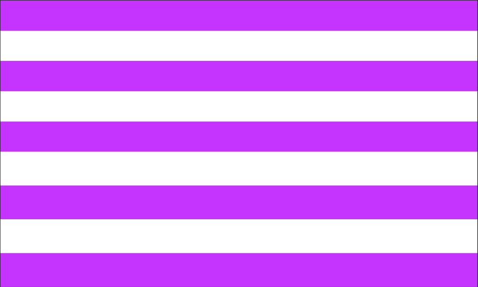

# 1일차: 웹 디자인 기초 및 Figma 시작하기

## 2교시: Figma 기본 인터페이스 익히기

### 1. Figma 소개

Figma는 웹 기반의 UI(사용자 인터페이스) 및 UX(사용자 경험) 디자인 툴입니다. 웹 브라우저에서 직접 작업하고 실시간으로 여러 사람과 협업할 수 있다는 점이 가장 큰 특징이자 장점입니다.

**핵심 특징:**

- **웹 기반:** 별도의 설치 없이 웹 브라우저를 통해 어디서든 접속하여 작업 가능 (데스크톱 앱 지원).
- **실시간 협업:** 다수의 사용자가 동시에 동일한 파일을 열어 함께 작업하며, 다른 사용자의 커서 움직임을 실시간으로 확인 가능.
- **모든 단계 지원:** 아이디어 스케치(와이어프레임)부터 실제 디자인(목업), 상호작용 가능한 프로토타입(시제품)까지 디자인 프로세스 전 과정 지원.
- **컴포넌트 및 스타일:** 재사용 가능한 디자인 요소를 생성하여 효율적인 디자인 시스템 구축 가능.
- **무료 플랜:** 개인 학습 및 소규모 프로젝트에 적합한 무료 플랜 제공.

**개발자에게 Figma 학습의 필요성:**

- **디자이너와의 소통:** 디자이너가 제작한 결과물을 직접 확인하고 필요한 디자인 속성(색상 코드, 폰트 크기, 간격 등)을 쉽게 파악하여 협업 효율 증대.
- **빠른 프로토타이핑:** 복잡한 코딩 없이 아이디어를 빠르게 시각화하고, 간단한 프로토타입을 제작하여 기능 사전 테스트 가능.
- **실무 필수 툴:** 현재 많은 기업에서 디자인 협업을 위해 Figma를 적극적으로 활용하며, Figma 활용 능력은 개발자에게 경쟁력으로 작용.

### 2. Figma 회원가입 및 프로그램 설치

- **Figma 웹사이트 접속:** `www.figma.com`
- **회원가입 (Sign Up):**
  - Google 계정으로 가입 (권장).
  - 이메일과 비밀번호로 가입.
  - (참고: 학생들은 미리 계정을 생성해 올 것을 권장했으나, 미생성 학생을 위해 가입 시간을 제공)
- **프로그램 설치 (선택 사항이나 권장):**
  - 웹 브라우저로도 사용 가능하나, 데스크톱 앱이 폰트 관리 등 일부 기능에서 더 편리하고 안정적일 수 있습니다.
  - Figma 웹사이트 하단의 Downloads 또는 Help and Account 메뉴에서 Desktop App 다운로드 및 설치 안내.
  - (팁: 즉시 설치하지 않아도 되며, 웹 브라우저로 시작 후 필요 시 나중에 설치 가능함을 안내하여 실습 지연 방지)
- **새 파일 생성:**
  - Figma 대시보드에서 `New design file` 클릭하여 새 작업 파일 열기 (혹은 `Drafts`에서 `+ Design file`).
  - (참고: 파일 이름은 '2일차\_기본도형실습' 등으로 통일하도록 안내)

### 3. Figma 작업 화면 구성

새로 생성된 Figma 파일의 인터페이스는 다음과 같이 구성됩니다.

- **1. 하단 메뉴 바:**
  - Move tool (V), Frame tool (F) 등 핵심 도구 아이콘
  - 스케치 모드, 디자인 모드, 개발 모드 전환
- **2. Draft 메뉴**
  - Draft 저장 및 내보내기와 같은 메뉴가 있음
  - 파일 이름 변경 가능 (`Untitled` 클릭)
  - 맨 오른쪽 창문 아이콘으로 메뉴 UI를 껏다켤 수 있음
- **3. Home 및 Draft 탭**
  - Home으로 이동
  - 열려있는 Draft를 Tab으로 보여줍니다
  - 껏다켜도 컴퓨터에서 연 Tab은 유지
- **4. Page**
  - 피그마는 Draft에서 여러 공간을 만들 수 있는데 그 공간을 Page라고 합니다.
  - Page 추가/삭제/이동
- **5. Layer**
  - 오브젝트(도형, 텍스트, 이미지 등)들의 층(순서)을 보여주는 곳
  - 포토샵/일러스트레이터의 레이어 개념과 유사
- **6. Share/Play 및 편집자 표시**
  - 프로필 사진: 현재 Draft를 편집 중인 사람들의 프로필입니다.
  - 재생버튼: 제작한 Prototype을 실행합니다.
  - Share: Draft를 공유합니다.
- **7. 속성**
  - 선택된 레이어 또는 Draft의 속성을 관리합니다.
- **8. Canvas**
  - 오브젝트를 배치할 수 있는 공간입니다.

**핵심 도구 간단 설명:**

- **Move tool (V):** 오브젝트 선택 및 이동.
- **Frame tool (F):** 디자인 작업 영역(화면 크기) 생성.
- **Rectangle (R), Line (L), Ellipse (O) 등:** 기본 도형 도구.

### 4. 기본 도형 도구 사용법 및 실습

#### 4.1. 새로운 기능 배우기

- **도형 도구 선택:** 상단 메뉴 바에서 `Rectangle` (사각형), `Line` (선), `Ellipse` (원) 등 아이콘 클릭.
- **도형 그리기:** 캔버스에 드래그하여 도형 생성.
- `Shift` 키를 누른 채 드래그 시 정사각형, 정원 등 정비율 도형 생성.
- **도형 속성 변경 (우측 속성 패널 활용):**
  - **Fill (채우기):** 색상 변경 (기본 색상 클릭 후 팔레트에서 선택 또는 HEX 코드 입력).
  - **Stroke (선/테두리):** 선 색상, 두께, 스타일 변경.
  - **Corner Radius (모서리 둥글기):** 사각형의 모서리를 둥글게 설정.
  - **Effect (효과):** 그림자(Drop Shadow), 레이어 블러 등 추가.
  - **Opacity (불투명도):** 오브젝트의 투명도 조절.

#### 4.2. 배운 기능을 활용한 예제 따라 만들기

  
  

- **실습 1: 기본 도형 그리기 및 속성 변경**
  - 사각형, 원, 선 각각 하나씩 그리기.
  - 각 도형의 `Fill` 색상 다르게 변경.
  - 사각형의 `Corner Radius` 조절.
  - 원에 `Stroke` 추가 및 두께 변경.

  
  

  
  

- **실습 2: 도형 복사, 이동, 크기 조절**
  - **선택:** `Move tool (V)`로 도형 선택.
  - **이동:** 선택된 도형 드래그 또는 화살표 키로 이동.
  - **크기 조절:** 선택된 도형의 모서리나 변에 있는 핸들 드래그 (`Shift` 키 누르고 드래그 시 비율 유지).
  - **복사:**
    - `Ctrl/Cmd + C` (복사) -> `Ctrl/Cmd + V` (붙여넣기).
    - **권장:** `Alt/Option` 키를 누른 채 드래그 시 원하는 위치에 즉시 복사 가능.
    - `Ctrl/Cmd + D` (Duplicate): 복사-붙여넣기 후 다음 이동 간격을 기억하여 동일 간격으로 연속 복사 가능.
  - **실습:**
    - 사각형을 하나 그린 후 `Alt/Option` 키로 3개 복사.
    - 원이 나란히 5개 있도록 `Ctrl/Cmd + D`를 활용하여 복사.
    - 여러 도형을 배치하고 크기를 다양하게 조절하여 간단한 패턴이나 무늬 생성.
