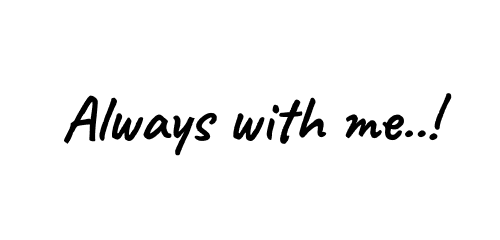
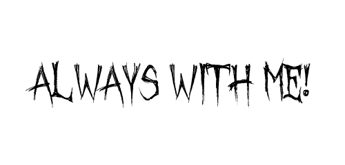
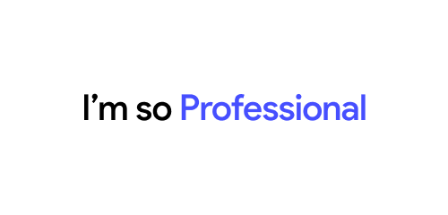
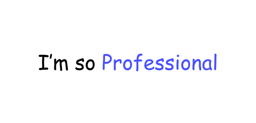
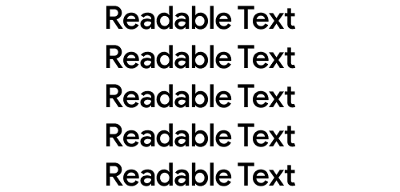
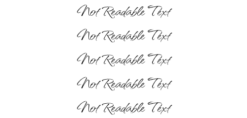
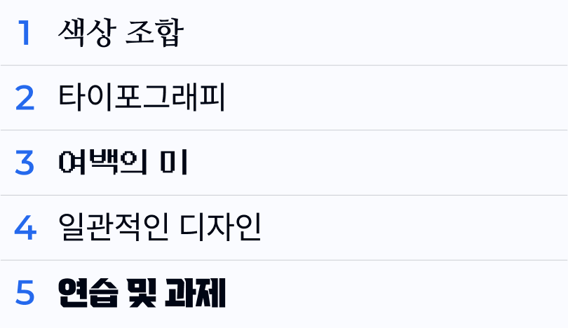
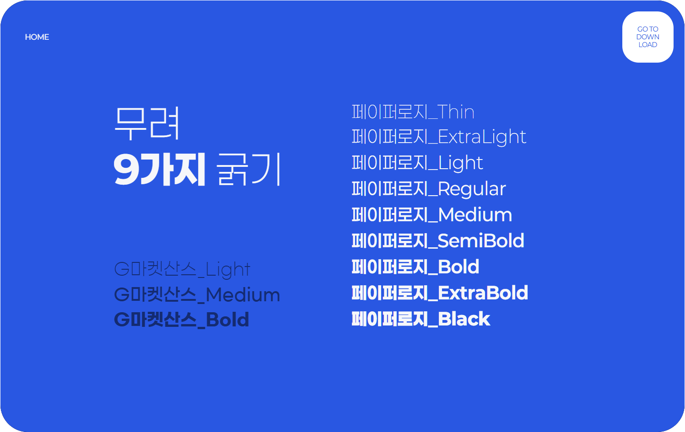

# 1. 폰트가 주는 느낌

> [!NOTE]
> 이 문서에서는 다양한 스타일의 폰트를 살펴보고, 각 폰트가 주는 분위기와 활용 예시를 이해합니다.

## 1.1. 여러 느낌의 폰트들

> [!TIP]
> 폰트는 디자인에서 ‘말투’와도 같습니다.  
> 같은 말이라도 어떤 글씨로 쓰느냐에 따라 **느낌이 완전히 달라집니다.**
>
> 각 아래에 적힌 예시 폰트를 검색해보세요

### 1.1.1. 고딕체 (Sans-serif)

> **예시:** Noto Sans, Pretendard, Apple SD Gothic Neo

- **느낌:** 깔끔하고 현대적인 느낌. 읽기 쉬우며 **웹/앱 UI**에 자주 사용.
- **활용 예:** 공공기관 안내문, 교과서, 앱 버튼, 타이틀

### 1.1.2. 장식체 (Decorative)

> **예시:** 학교안심 둥근미소, HS봄바람체, 연성체 등

- **느낌:** 귀엽거나 유쾌하고 개성 있는 분위기. 주로 포스터, 카드 등에 사용.
- **주의:** 본문에는 가독성이 떨어질 수 있으므로 제한적으로 사용

### 1.1.3. 궁서체 (Cursive/Calligraphic)

> **예시:** 궁서, 대한체

- **느낌:** 전통적이고 격식 있는 분위기. 격조 높고 진지한 인상을 줌.
- **활용 예:** 전통 행사, 한복 관련 홍보물, 시화전

### 1.1.4. 명조체 (Serif)

> **예시:** 바탕체, 본명조, KoPub Batang

- **느낌:** 클래식하고 정제된 인상. 활자의 끝에 삐침(세리프)이 있음.
- **활용 예:** 신문, 잡지, 전통 느낌의 웹페이지

### 1.1.5. 굴림체

> **예시:** 굴림

- **느낌:** 예전 컴퓨터 기본 폰트. 다소 투박하고 정형적인 인상.
- **활용 예:** 고전적인 느낌을 줄 때, 일부 컨셉 작업에 한정

### 1.1.6. 붓글씨체 (Brush)

> **예시:** 서울한강 장체, 아리따흑체

- **느낌:** 붓으로 쓴 듯한 힘있는 느낌. 감성적이고 예술적인 분위기.
- **활용 예:** 감성 문구, 전통/캘리그라피 느낌의 디자인

### 1.1.7. 손글씨체 (Handwriting)

> **예시:** 가비아 솔미체, 티머니 둥근한글, 배민체

- **느낌:** 자연스럽고 친근한 느낌. 사람의 손으로 직접 쓴 듯한 폰트.
- **활용 예:** 편지, 인스타 콘텐츠, 일기 느낌의 디자인

### 1.1.8. 굴린고딕체 (Rounded Gothic)

> **예시:** Noto Sans Rounded, Gmarket Sans Light

- **느낌:** 둥글고 부드러운 인상. 안정감 있고 따뜻한 느낌을 줌.
- **활용 예:** 키즈 브랜드, 식품 포장, 친근한 UI/UX

## 1.2. 폰트가 중요한 이유

#### 이유 1: 의도가 잘못 전달될 수 있음

  
  

#### 이유 2: 조잡해보이는 느낌 전달 가능성

  
  

#### 이유 3: 접근성 향상

  
  

#### 이유 3: 디자인 일관성

## 1.3. 폰트 다운로드

> [!WARNING]
> 대부분의 한글 폰트는 무료로 사용할 수 있지만, 꼭!! 저작권과 사용 가능 범위를 확인한 후 사용해야 합니다.

- **추천 사이트:**
  - [눈누 (noonnu.cc)](https://noonnu.cc) : 웹에서 바로 사용 가능한 무료 한글 폰트 모음
  - [네이버 나눔글꼴](https://hangeul.naver.com/2017/nanum) : 깔끔한 기본용 폰트
  - [서울시 서체](https://www.seoul.go.kr/story/font.do) : 감성적인 공공 폰트 다수 제공
  - [배민 폰트](https://www.woowahan.com/#/fonts) : 캐주얼하고 친숙한 스타일 다수

## 1.4. 앞으로 우리가 쓸 폰트

### **Paperlogy** 폰트

- **느낌:** 깔끔하고 부드러운 느낌의 디스플레이용 고딕체
- **특징:** 제목용/포스터용으로 적합, 조형미가 돋보이며 어느 디자인에나 잘 어울림
- **활용:** 이후 실습(명함/현수막 등)에서 기본 폰트로 사용 예정

> [!TIP]  
> **다른 폰트도 자유롭게 써보세요!**  
> 실습 중 분위기나 컨셉에 맞는 폰트를 찾는 것도 중요한 디자인 능력입니다.
