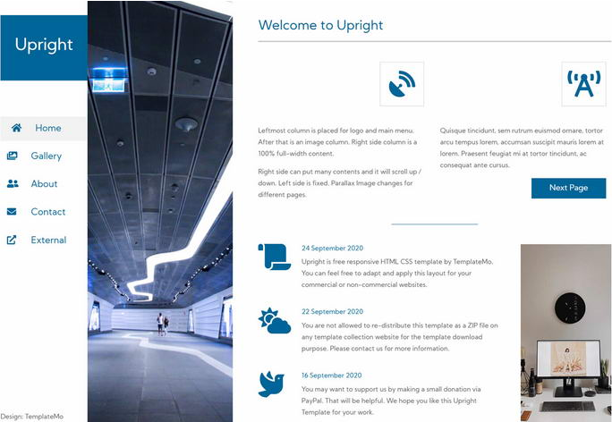
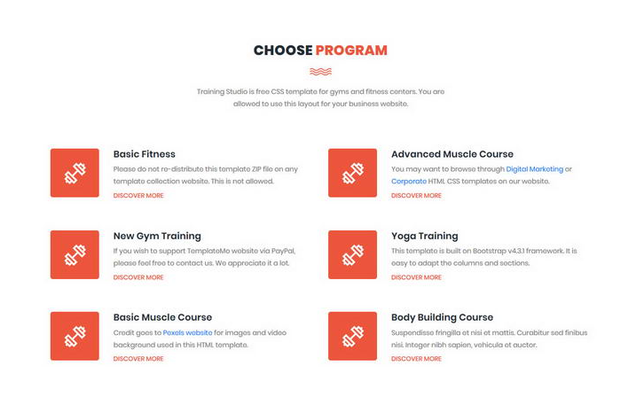
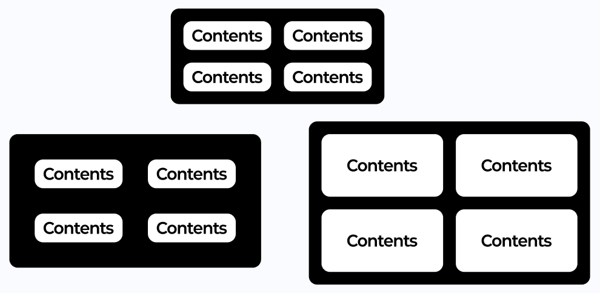

# 2. 여백이 주는 편안함

> [!NOTE]  
> 이 문서에서는 여백의 개념을 인식시키고 잘 활용할 수 있도록 여백의 사용 예시를 안내합니다.

## 2.1. 여백의 개념

> [!TIP]  
> 여백은 ‘비어 있는 공간’이지만, 디자인에서 아주 중요한 ‘의도된 공간’입니다.

- 여백(Margin, Padding, Space)은 콘텐츠와 콘텐츠 사이, 혹은 콘텐츠와 프레임(또는 화면) 사이에 의도적으로 비워두는 공간입니다.
- 사용자의 시선을 정리해주고, 콘텐츠를 명확하게 구분할 수 있도록 돕습니다.
- 디자인을 숨 쉬게 만드는 역할을 하며, 고급스러움과 안정감을 줍니다.

## 2.2. 여백이 중요한 이유

### 이유 1: 정보의 우선순위를 명확히 해줌

- 여백을 활용하면 핵심 정보가 강조되고, 덜 중요한 정보는 부각되지 않음
- 사용자는 어떤 정보를 먼저 읽어야 할지 쉽게 파악 가능

### 이유 2: 디자인에 고급스러움을 부여

- 복잡한 디자인보다 정돈된 디자인이 더 세련돼 보입니다.
- 고급 브랜드일수록 여백을 과감하게 활용하는 경우가 많습니다.

### 이유 3: 사용자 피로 감소

- 요소들이 너무 가깝게 붙어있으면 읽기 어렵고 시각적으로 피로함
- 여백은 눈에 쉬는 공간을 제공해 줍니다

## 2.3. 여백 사용 예시

  
  

- **왼쪽:** 여백 없이 모든 요소가 빽빽하게 들어차 있어 답답하고, 어디를 먼저 봐야 할지 혼란스럽습니다.
- **오른쪽:** 충분한 여백 덕분에 각 요소가 명확히 분리되고, 시선이 자연스럽게 흐릅니다.

> [!TIP]  
> 여백이 많다고 꼭 공간이 낭비되는 것이 아닙니다. “덜어낼수록 전달력은 높아집니다.”

## 2.4. 여백 설정 팁 (Figma 기준)

- 요소 간 **Padding(내부 여백)** 과 **Margin(외부 여백)** 을 구분해 설정합니다.
- 반복되는 [컴포넌트](/day_3/08-Component.md)는 [**Auto Layout**](/day_2/07-Auto-Layout.md) 기능을 활용해 일관된 간격 유지.
- **정렬 및 간격 설정 도구**를 활용하여 여백을 정돈되게 유지.

- 여백이 너무 적을 경우 / 너무 많을 경우 비교
- 가장 보기 편하고 안정적인 여백 찾기
- "숨 쉴 틈 있는 디자인" 실현하기
