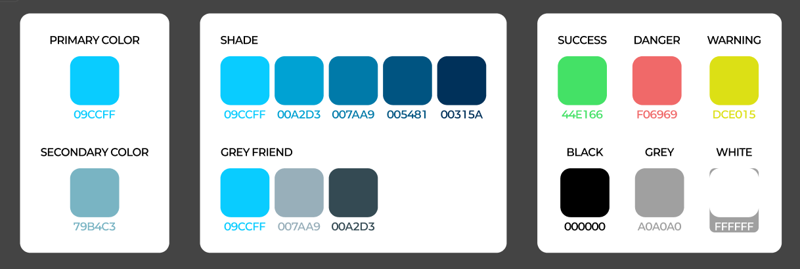
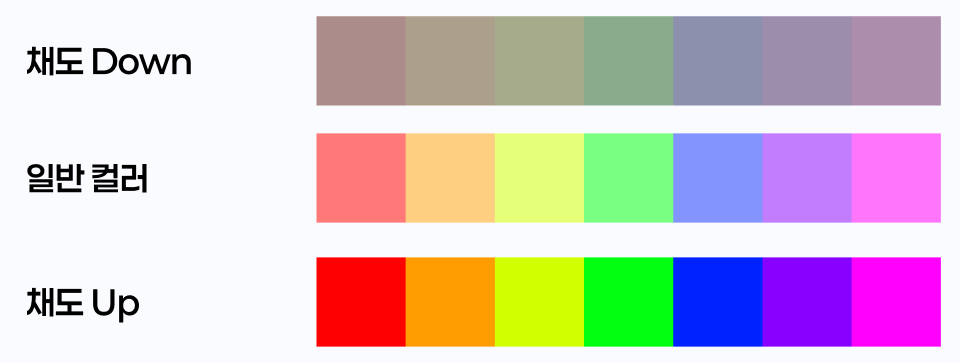
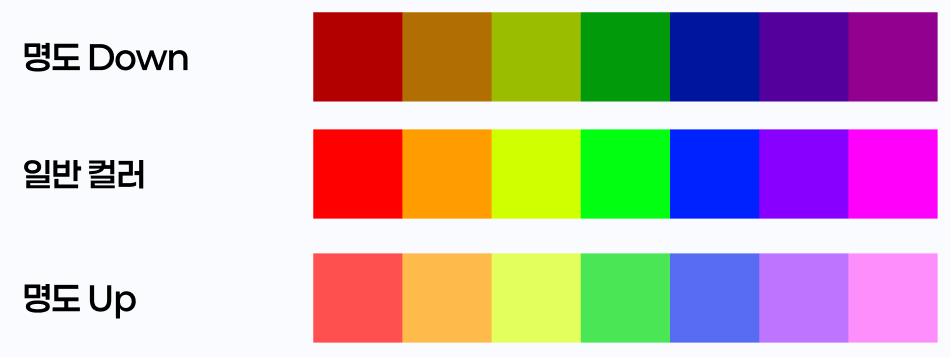
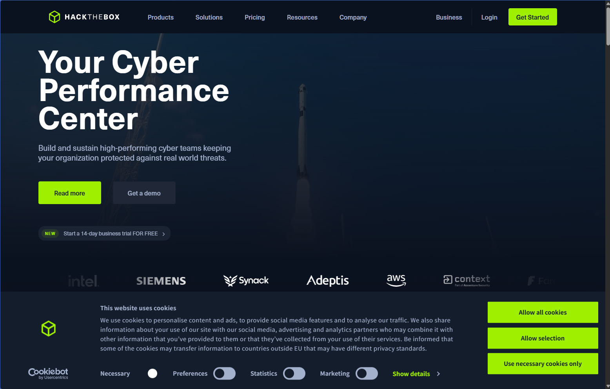
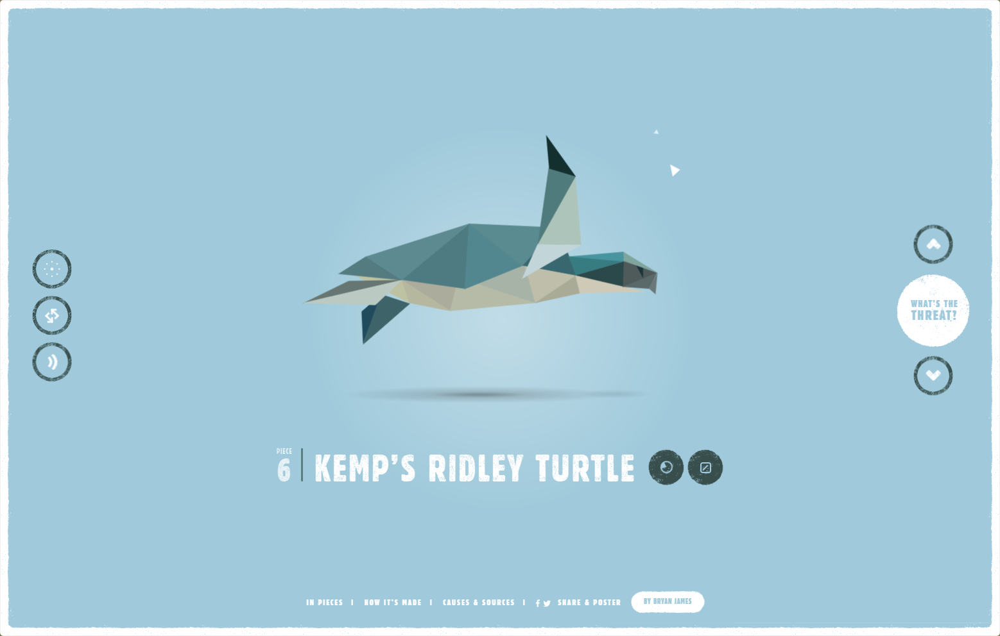
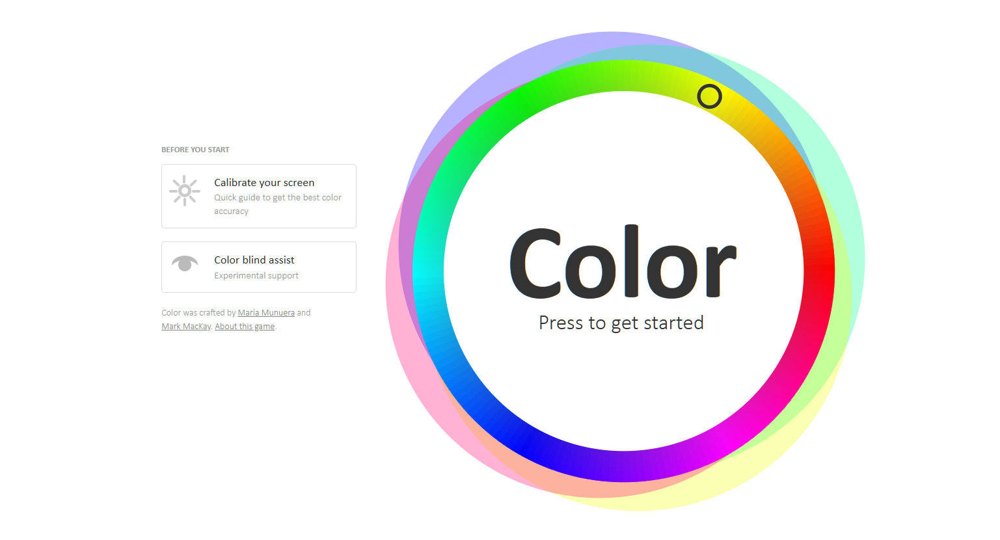

# 3. 색상 팔레트 및 색 조합

> [!NOTE]  
> 이 문서에서는 색상 팔레트의 기본 개념과 조화로운 색상 조합 방법에 대해 설명합니다.

## 3.1. 색상 팔레트란?

> [!TIP]  
> 색상 팔레트는 디자인에서 사용하는 주요 색상들을 정리한 모음표입니다.

- 브랜드나 프로젝트에 맞는 **주조색(Primary Color)**, **보조색(Secondary Color)**, **강조색(Accent Color)** 등을 미리 정의해두는 것
- 색상 간의 조화와 통일성을 유지하기 위한 기준이 됨
- Figma에서는 색상 스타일로 팔레트를 저장하고 재사용 가능

## 3.2. 색상 기본 개념

| 용어               | 설명                                     | 예시                                 |
| ------------------ | ---------------------------------------- | ------------------------------------ |
| Hue (색상)         | 빨강, 파랑, 초록 등 색의 종류            | Red, Blue, Green 등                  |
| Saturation (채도)  | 색의 선명도. 채도가 낮으면 회색에 가까움 | 채도 100% = 선명함 / 채도 10% = 탁함 |
| Brightness (명도)  | 색의 밝기. 어두운 색 ~ 밝은 색           | 어두운 남색 / 밝은 하늘색            |
| Opacity (불투명도) | 투명한 정도. 0%는 완전 투명              | 100% = 불투명 / 0% = 투명            |

## 3.3. 색 조합의 유형

> [!WARNING]  
> 물감이 섞이면 검정색에 가까워지듯이, 아무 색이나 섞는다고 예쁜 조합이 되지는 않습니다!  
> 아래의 조합 방법들을 참고하세요.

### 1. **보색 조합 (Complementary)**

  
  

- **정반대 색상**을 조합하여 강한 대비를 줌
- 시각적 자극이 크고, 포인트 강조에 적합

> 예: 파랑 + 주황 / 초록 + 빨강

### 2. **유사색 조합 (Analogous)**

- **인접한 색상끼리** 조합해 부드럽고 안정적인 느낌
- 자연스럽고 조화로운 분위기에 적합

> 예: 파랑 + 하늘색 + 청록색

### 3. **삼각형 조합 (Triadic)**

- 색상환에서 **정삼각형** 모양으로 떨어진 색상들
- 균형과 생동감을 줌

> 예: 빨강 + 파랑 + 노랑

### 4. **단색 조합 (Monochromatic)**

- 하나의 색상에서 **명도/채도만 변화**시킨 조합
- 심플하고 통일감 있는 느낌

> 예: 연보라 + 중간보라 + 진보라

## 3.4. 색상 조합 예시 (실습에 활용 가능)

  
  

- 왼쪽: 보색 기반의 강렬한 브랜드 디자인
- 오른쪽: 유사색 기반의 부드러운 레이아웃

## 3.5. 색상 사용 팁

- **텍스트에는 대비가 높은 색상 사용 (예: 흰색 배경 + 검정 글자)**
- **한 화면에 너무 많은 색상 사용 X (3~5개 권장)**
- **브랜드 컬러는 일관되게 사용**
- **색맹 사용자도 고려한 색상 대비 확보**

> [!TIP]  
> Figma에서는 `Plugins > Contrast`를 통해 색 대비를 확인할 수 있습니다.

## 3.6. 컬러 마스터가 되어보자

https://color.method.ac/
