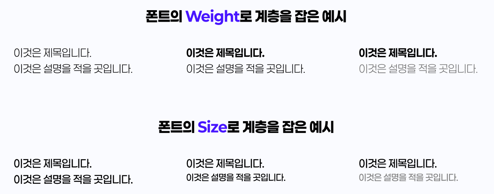

# 4. 시각적 계층 구조

> [!NOTE]  
> 이 문서에서는 다양한 디자인 상황에서 계층 구조의 개념과 필요성, 그리고 적용 방법에 대해 설명합니다.

## 4.1. 계층 구조란?

> [!TIP]  
> 계층 구조는 사용자에게 **무엇이 더 중요하고**, **어디를 먼저 봐야 하는지**를 안내하는 시각적 순서입니다.

- 디자인에서 정보의 **우선순위**를 명확히 전달하는 기법
- 사용자 시선이 **자연스럽게 흐르도록** 구성
- 디자인이 아무리 예뻐도 정보 전달이 어렵다면 UX 실패

## 4.2. 계층 구조의 예시

| 요소                 | 예시 설명                                      |
| -------------------- | ---------------------------------------------- |
| **크기 (Size)**      | 큰 제목 > 작은 본문 텍스트                     |
| **색상 (Color)**     | 강조색으로 CTA 버튼(예: 구매하기)을 눈에 띄게  |
| **굵기 (Weight)**    | 굵은 글씨로 중요한 정보 강조                   |
| **간격 (Spacing)**   | 요소 간 여백을 달리하여 구역 구분              |
| **정렬 (Alignment)** | 왼쪽 정렬/중앙 정렬 등으로 정보 간의 흐름 유도 |
| **배치 (Position)**  | 위쪽에 위치한 요소가 더 중요하다고 인식됨      |

## 4.3. 잘 만든 계층 구조 예시

  
  

- **왼쪽:** 제목 → 부제목 → 본문 → 버튼 순으로 시선 흐름이 자연스러움
- **오른쪽:** 시선이 어디로 가야 할지 모호하고 정보 전달력이 떨어짐

## 4.4. 계층 구조 정리

- **중요한 정보는 먼저, 크게, 눈에 띄게**
- **정보 간의 관계를 시각적으로 구분**
- **사용자가 머뭇거리지 않고 행동할 수 있도록**

> [!WARNING]  
> 모든 요소를 강조하면 **아무것도 강조되지 않습니다!**  
> 핵심 메시지를 먼저 정하고 그에 맞춰 시각적인 위계를 설계하세요.
