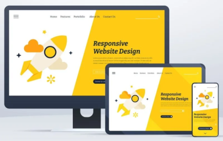

# 5. 반응형 디자인

> [!NOTE]  
> 이 문서에서는 디바이스의 화면 크기에 따라 자동으로 변화하는 반응형 디자인(Responsive Design)의 개념과 필요성에 대해 설명합니다.

## 5.1. 반응형 디자인이란?

> [!TIP]  
> 하나의 디자인으로 다양한 화면 크기(PC, 태블릿, 모바일 등)에 유연하게 대응하는 웹 디자인 방식입니다.

- 다양한 디바이스에서 콘텐츠가 **자동으로 최적화**되도록 설계
- 화면 해상도나 비율에 따라 요소의 **크기, 위치, 정렬 방식** 등이 동적으로 조정
- 별도 모바일/PC 버전을 나누지 않아도 하나의 디자인으로 대응 가능

## 5.2. 왜 반응형 디자인이 중요한가?

| 이유                        | 설명                                                              |
| --------------------------- | ----------------------------------------------------------------- |
| **모바일 사용자 증가**      | 전체 웹 트래픽의 절반 이상이 모바일에서 발생 (스마트폰 중심 환경) |
| **유지 관리 효율**          | 하나의 디자인만 수정하면 모든 디바이스에 반영되어 관리가 쉬움     |
| **일관된 사용자 경험 (UX)** | 어떤 기기로 접속하든 **동일한 브랜드 느낌**과 사용 흐름 유지 가능 |
| **검색 엔진 최적화 (SEO)**  | 구글은 모바일 친화적인 페이지를 우선적으로 노출                   |

## 5.3. 반응형 디자인의 핵심 구성 요소

| 요소                 | 설명                                                                 |
| -------------------- | -------------------------------------------------------------------- |
| **유동적 그리드**    | 화면 크기에 따라 자동으로 비율이 조정되는 레이아웃 시스템            |
| **반응형 이미지**    | 디바이스에 따라 이미지 크기 또는 해상도를 조절하여 로딩 속도 최적화  |
| **미디어 쿼리**      | CSS에서 화면 크기에 따라 다른 스타일을 적용하는 기술 (`@media`) 사용 |
| **텍스트 크기 조절** | 화면에 따라 가독성 좋은 텍스트 크기 제공                             |

## 5.4. 반응형 디자인 예시

- 동일한 콘텐츠를 PC, 태블릿, 모바일 환경에서 각각 다르게 표현하여 최적화된 사용자 경험 제공
- UI 요소 크기, 정렬 방식, 버튼 배치 등이 모두 달라짐

  
<strong>Question</strong>

  
반응형 디자인이 적용된 웹 사이트를 찾아볼까요?

## 5.5. 정리

> [!TIP]  
> **"디자인은 보는 것만이 아니라, 어떤 환경에서도 잘 보이게 만드는 것이다."**

- 반응형 디자인은 현대 웹 디자인의 **표준**
- 다양한 사용자 환경을 고려한 **포용적인 디자인**
- **Figma의 Auto Layout**과 **Constraints** 기능은 반응형 UI 제작에 필수
