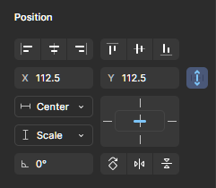

# 6. 기준점

> [!NOTE]  
> 이 문서에서는 [반응형 디자인](./05-Responsible-Design.md)과 연계하여 오브젝트의 Anchor Point(기준점)에 대해 설명합니다. 기준점은 요소가 프레임 내에서 어떻게 반응하고 위치를 유지할지를 결정하는 중요한 속성입니다.

## 6.1. 기준점이란?

- **기준점(Anchor Point)** 또는 **Constraints(제약 조건)**은  
  프레임 크기가 변할 때 오브젝트가 어떤 방향과 위치를 기준으로 **유지 또는 변화**할지를 결정하는 설정입니다.
- Figma에서는 선택한 오브젝트의 **우측 속성 패널 > Constraints** 섹션에서 설정할 수 있습니다.

## 6.2. 기준점 설정 방법 (Figma)

- 오브젝트를 선택하면 우측에 Constraints 패널이 활성화됩니다.
- **기본값은 ‘Top & Left’** (왼쪽 위를 기준으로 위치 유지)
- 다음과 같은 설정이 가능:
  - **Top / Bottom / Left / Right**: 해당 방향과의 거리를 유지
  - **Center**: 프레임의 중앙 기준으로 위치 유지
  - **Scale**: 프레임의 크기에 따라 비율로 늘어나거나 줄어듦
- 수직, 수평 각각 설정 가능 (예: Left + Center / Top + Bottom 등)

## 6.3. 기준점 설정 예시

> 강사의 PC 화면을 보면서 따라 만들어봐요

### 예시 1: 상단 고정 버튼

- **설정:** Top + Center
- 프레임 크기가 늘어나도 버튼은 항상 위쪽 중앙에 고정

### 예시 2: 하단 오른쪽 고정 알림 버튼

- **설정:** Bottom + Right
- 모바일, 태블릿, PC 프레임 크기가 달라도 오른쪽 아래에 고정되어 일관된 UX 제공

### 예시 3: 배너 이미지의 가로 스케일 확장

- **설정:** Left + Right
- 프레임이 넓어질 때 이미지가 양옆으로 늘어나도록 설정
- (필요시 수직 방향은 Top 고정으로 설정)

## 6.4. 기준점 활용 팁

- **중앙 정렬 버튼:** Center 설정을 활용하여 어떤 프레임에서도 버튼이 가운데에 유지되도록 함
- **네비게이션 바:** Top + Left + Right 설정으로 프레임 너비에 따라 자동으로 확장
- **이미지 그리드:** 각 요소에 Left + Top으로 설정하거나 Auto Layout과 병행 사용

## 6.5. 정리

> [!NOTE]  
> 기준점은 **반응형 디자인의 핵심 기초**입니다. 작은 화면에서도 동일한 사용자 경험을 제공하려면, 각 오브젝트가 언제 어디에 위치해야 하는지 미리 설정하는 것이 중요합니다.

- Figma에서 Constraints 설정은 필수 실무 기능
- 오브젝트마다 적절한 기준점 설정을 통해 유연한 레이아웃 완성
