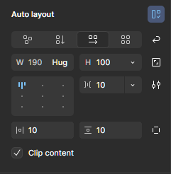

# 7. Auto Layout

> [!NOTE]  
> 이 문서에서는 [반응형 디자인](./05-Responsible-Design.md)과 연계하여 Auto Layout과 활용 예시를 설명합니다.

## 7.1. Auto Layout이란?

- **Auto Layout**은 Figma에서 오브젝트 간의 간격, 정렬, 패딩 등을 자동으로 설정해주는 레이아웃 기능입니다.
- 프레임에 적용되며, 내부 요소가 변경되더라도 일관된 배치를 유지할 수 있도록 돕습니다.
- **반응형 디자인의 핵심 도구** 중 하나로, 다양한 화면 크기에 맞춰 자동 정렬되는 UI를 만들 수 있습니다.

## 7.2. Auto Layout 기본 개념

- **Direction (방향):**

  - 오브젝트를 세로로 쌓을지, 가로로 나열할지 선택 (Vertical / Horizontal)

- **Spacing (간격):**

  - Auto Layout이 적용된 박스의 자식 오브젝트 사이의 간격 설정

- **Padding (내부 여백):**

  - Auto Layout이 적용된 박스 안에서 콘텐츠와 가장자리 사이의 여백 설정

- **Alignment (정렬):**

  - 상단 정렬, 중앙 정렬, 왼쪽 정렬 등 설정 가능

- **Resize 옵션:**
  - Fixed(고정), Hug contents(콘텐츠 크기에 맞춤), Fill container(부모 프레임에 맞춤)

## 7.3. Auto Layout 적용 방법

1. **오브젝트 선택**
   - 정렬하고 싶은 도형, 텍스트 등을 선택
2. **Auto Layout 적용**
   - `Shift + A` 단축키 또는 우측 패널에서 **+ Auto layout** 클릭
3. **설정 조정**
   - 방향, 간격, 패딩 등을 조정하여 원하는 레이아웃 완성

## 7.4. Auto Layout 예시

### 예시 1: 버튼 만들기

- **구성:** 텍스트(`확인`) + 배경 사각형
- Auto Layout 적용 시 텍스트가 바뀌더라도 버튼 크기가 자동으로 조정됨
- Padding을 이용해 여백 유지

### 예시 2: 카드형 리스트 만들기

- **구성:** 이미지 + 텍스트 + 버튼 등 여러 요소가 정렬된 UI
- 세로 방향 Auto Layout으로 카드 형태 구성
- **Spacing + Padding + Alignment** 기능을 활용해 깔끔한 리스트 생성

### 예시 3: 반응형 내비게이션 바

- 가로 방향 Auto Layout 적용
- **Fill container** 옵션을 사용하면 프레임이 넓어져도 자동으로 간격 유지하며 확장

## 7.5. Auto Layout 실전 팁

- **모든 UI 요소에 Auto Layout 적용하기보다는**, 반복되는 구조나 반응형이 필요한 요소에 우선 적용
- 텍스트가 변경될 수 있는 버튼, 태그, 알림 카드 등에 매우 유용
- 중첩된 Auto Layout도 가능 (예: 버튼 + 버튼 묶음을 다시 하나의 Auto Layout으로)

## 7.6. 정리

> [!TIP]  
> Auto Layout은 **반응형 + 일관성 + 유지보수 용이성**을 위한 필수 기능입니다.

- 수동 정렬의 반복에서 벗어나, 자동화된 구조 설계를 통해 효율적인 디자인 가능
- 나중에 텍스트나 콘텐츠가 바뀌더라도 전체 구조가 무너지지 않도록 구성
- 개발자에게도 명확한 구조 전달이 가능하여 협업에 매우 유리함
