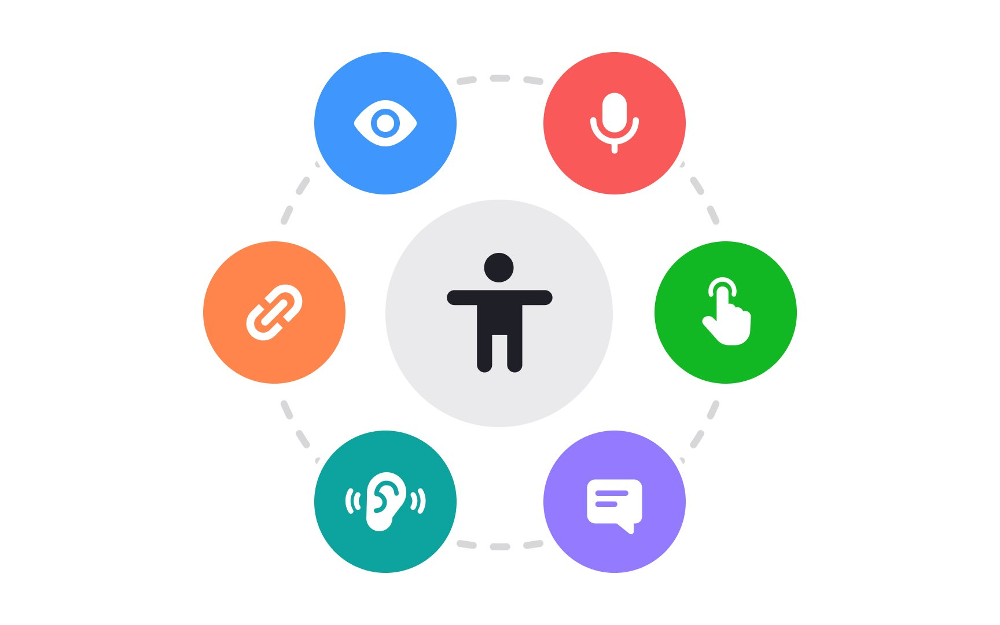

# 1. 접근성

> [!NOTE]
> 이 문서에서는 접근성 고려에 대한 필요성을 안내합니다.

## 1.1. 접근성이란?

- 접근성(Accessibility)이란 장애를 가진 사람도 포함하여 모든 사용자가 제품이나 서비스를 불편 없이 사용할 수 있도록 하는 설계 기준입니다.
- 시각, 청각, 운동, 인지 등 다양한 장애 유형을 고려하여 디자인과 기능을 만드는 것이 중요합니다.
- 웹 접근성은 모든 사람이 웹 콘텐츠에 쉽게 접근하고 이용할 수 있도록 보장하는 원칙입니다.

## 1.2. 접근성 고려의 중요성

- **법적 요구사항:** 많은 국가에서 웹 접근성 관련 법률 및 가이드라인을 의무화하고 있습니다.
- **사용자 확대:** 장애가 없는 사람도 노안, 일시적 부상, 환경적 제한 등으로 접근성 기능을 필요로 할 수 있습니다.
- **브랜드 신뢰도:** 모두를 배려하는 기업 이미지 강화 및 긍정적인 브랜드 경험 제공.
- **검색 엔진 최적화(SEO):** 접근성을 개선하면 검색 엔진의 인덱싱 효율도 향상됩니다.

## 1.3. 디자인에서의 접근성 고려사항

- **명확한 대비:** 텍스트와 배경 간 충분한 대비 비율 유지 (WCAG 권장 최소 4.5:1).
- **명확한 폰트:** 가독성 높은 폰트와 적절한 글자 크기 사용.
- **키보드 접근성:** 마우스 없이 키보드로도 모든 기능 사용 가능하도록 설계.
- **대체 텍스트 제공:** 이미지, 아이콘 등 시각 자료에 대체 텍스트(alt text) 삽입.
- **명확한 인터페이스:** 버튼과 링크 등은 크기와 간격을 충분히 확보하여 쉽게 클릭 가능하도록 디자인.
- **애니메이션 주의:** 과도한 깜빡임이나 빠른 움직임은 발작 위험을 유발할 수 있으므로 주의.

## 1.4. 브라우저에서의 접근성 및 호환성

> 크롬에선 되는데 사파리에선 안될 수도 있어요!

- **크로스 브라우징:**
  - 다양한 웹 브라우저(Chrome, Edge, Safari, Firefox 등)에서 동일하게 작동하고 표시되도록 설계하는 것.
  - 각 브라우저의 렌더링 엔진 차이로 인해 UI/UX가 다르게 보일 수 있으므로 테스트가 필수.
- **반응형 웹 디자인:**
  - 데스크톱, 태블릿, 모바일 등 다양한 기기 화면 크기에 맞춰 레이아웃과 콘텐츠가 유연하게 변하도록 설계.
  - 사용자가 어떤 기기에서 접속하든 최적화된 경험을 제공하여 접근성을 높임.
- **웹 표준 준수:**
  - HTML, CSS, JavaScript 등 웹 기술 표준을 준수하여 모든 브라우저와 기기에서 일관된 동작을 보장.
  - 웹 표준을 지키면 보조 기술(스크린 리더 등)과의 호환성도 높아져 접근성이 향상됨.
- **성능 최적화:**
  - 빠른 로딩 속도와 부드러운 인터랙션은 모든 사용자에게 중요한 접근성 요소.
  - 특히 저사양 기기나 느린 인터넷 환경의 사용자에게 더욱 중요.
- **신기술 호환성:**
  - 웹브라우저는 웹페이지를 보여줄 때 효율적으로 보여주기 위해 새로운 문법과 기능이 개발됩니다. 웹표준을 추가하면서 기능이 개발되지만 일부 업데이트가 느린 브라우저 또는 추가하지 않는 브라우저는 웹페이지가 제대로 표시되지 않을 수도 있습니다.

  
<strong>Question</strong>

  
Internet Explorer가 지원 종료된 이유는 무엇일까요?

## 1.5. Figma에서의 접근성 도구 활용

- **Contrast Checker:** 색상 대비를 체크할 수 있는 플러그인 활용.
- **Simulations:** 색약, 색맹 시뮬레이션 플러그인으로 다양한 사용자의 시각 경험 확인.
- **명확한 네이밍:** 레이어 및 컴포넌트에 명확한 이름 부여로 협업과 접근성 지원.

## 1.6. 결론

> [!TIP]  
> 좋은 디자인은 모두를 위한 디자인입니다.

- 초기 단계부터 접근성을 고려하는 것이 비용과 시간을 절감하고 사용자 만족도를 극대화하는 길입니다.
- 장애가 있는 사용자도 편리하게 이용할 수 있는 서비스를 만들어 모두가 함께하는 사회를 지향합시다.

  
<strong>Question</strong>

  
우리가 손쉽게 접할 수 있는 접근성 메뉴를 찾아봐요!

