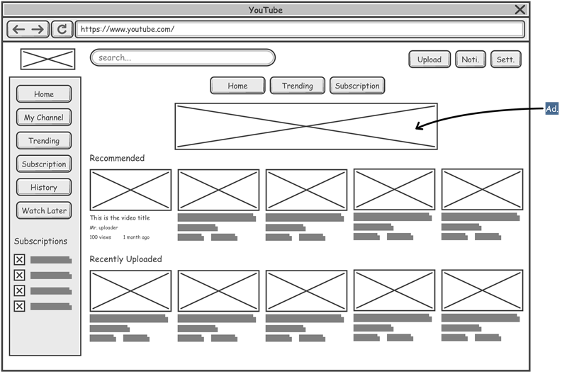

# 2. 와이어프레임

> [!NOTE]  
> 이 문서에서는 와이어프레임의 개념과 필요한 예시 상황을 설명합니다.

## 2.1. 와이어프레임이란?

- 와이어프레임(Wireframe)은 웹사이트나 앱 등 디지털 제품의 기본적인 구조와 레이아웃을 시각적으로 표현한 설계도입니다.
- 디자인의 골격을 잡는 단계로, 색상, 이미지, 폰트 등의 시각적 요소는 최소화하고 기능과 배치에 집중합니다.
- 사용자의 흐름과 주요 요소들의 위치, 크기, 관계를 빠르게 파악하고 수정할 수 있게 도와줍니다.

## 2.2. 와이어프레임의 주요 목적

- **아이디어 시각화:** 초기 기획 단계에서 구조와 기능을 명확히 전달.
- **피드백 수집:** 이해관계자 및 팀원과 빠른 소통과 의사결정 지원.
- **효율적 개발:** 명확한 설계로 개발자와 디자이너 간 협업을 원활하게 함.
- **사용자 경험 개선:** 사용자 흐름과 인터페이스 문제점을 사전에 발견.

## 2.3. 와이어프레임 예시 상황

- **새로운 웹사이트 기획 시**  
  전체 페이지 구조와 주요 콘텐츠 배치를 구상할 때.

- **앱 화면 설계 시**  
  기능별 화면 흐름과 버튼 배치 등을 결정할 때.

- **기존 서비스 리뉴얼 시**  
  구조 변경 전 대략적인 틀을 잡아 변화 방향을 공유할 때.

## 2.4. 와이어프레임 작성 시 고려사항

- 단순하고 명확한 요소 사용 (박스, 선, 텍스트 레이블 등)
- 중요한 기능과 콘텐츠 위주로 배치
- 사용자 흐름과 인터랙션을 반영
- 피드백을 반영해 반복적으로 수정

## 2.5. Figma에서 와이어프레임 만들기 팁

- 기본 도형과 텍스트만으로 빠르게 구성
- 컴포넌트 활용으로 반복 요소 효율적 관리
- 댓글 기능을 활용해 피드백 수집
- 프로토타입 기능으로 흐름 확인 가능

> [!TIP]  
> 와이어프레임은 완벽한 디자인이 아니라 ‘기본 뼈대’를 만드는 과정임을 기억하세요!
