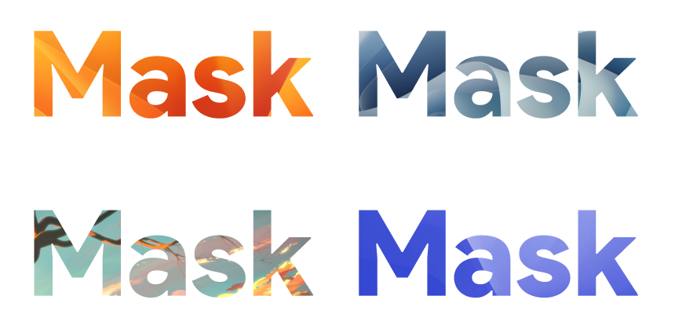
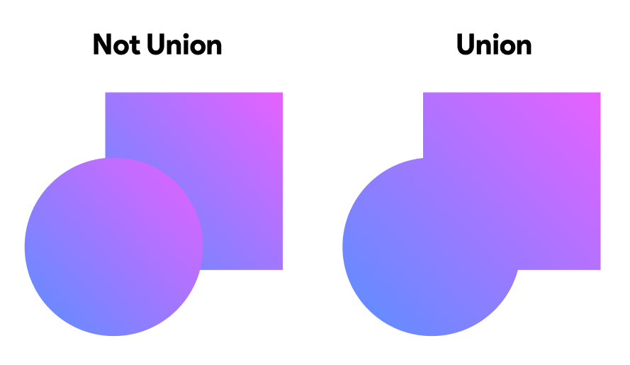
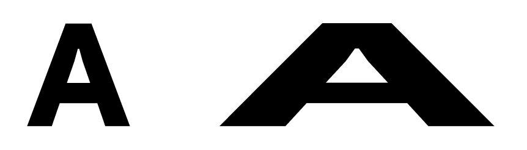

# 5. 마스크 & Union & Outline Stroke

> [!NOTE]  
> 이 문서에서는 마스크, Union Shape, Outline Stroke에 대해 설명하고 상세 예시를 소개합니다.

## 5.1. 마스크(Mask)란?

- **정의:** 선택한 한 오브젝트를 기준으로 다른 오브젝트의 보이는 영역을 제한하는 기능입니다.
- **용도:** 특정 부분만 보이도록 하여 복잡한 이미지를 깔끔하게 표현할 때 사용합니다.
- **작동 원리:** 마스크 역할을 하는 오브젝트의 형태 안에 포함된 영역만 보이고, 바깥 부분은 숨겨집니다.
- **Figma에서 사용법:**
  - 마스크로 사용할 도형을 가장 위에 배치.
  - 여러 오브젝트 선택 후 `Ctrl/Cmd + Alt + M` 또는 마우스 오른쪽 클릭 > `Use as Mask` 선택.

  
<strong>Question</strong>

  
마스크 기능을 활용해서 무엇을 할 수 있을까요?

## 5.2. Union Shape (합집합) 기능

- **정의:** 두 개 이상의 벡터 오브젝트를 하나의 형태로 합치는 Boolean Operation 중 하나입니다.
- **특징:** 선택된 모든 오브젝트가 하나로 결합되어, 합쳐진 외곽선만 남습니다.
- **용도:** 복잡한 도형을 만들 때 기본 도형들을 합쳐 새로운 형태를 쉽게 제작할 수 있습니다.
- **Figma에서 사용법:**
  - 합칠 오브젝트들을 선택 후, 상단 Boolean Operation 메뉴에서 `Union selection` 클릭.

  
<strong>Question</strong>

  
Union 말고 다른 것도 사용해봐요!

## 5.3. Outline Stroke (스트로크 외곽선 만들기)

- **정의:** 선(Stroke)을 윤곽선(Outline) 형태의 독립된 벡터 도형으로 변환하는 기능입니다.
- **용도:** 선 두께를 조절하거나, 스트로크 형태를 더 자유롭게 편집할 때 유용합니다.
- **작동 원리:** 스트로크가 내부 도형으로 변환되어, 선을 독립된 벡터 모양처럼 조작할 수 있습니다.
- **Figma에서 사용법:**
  - 스트로크가 있는 도형을 선택한 후, 마우스 오른쪽 클릭 > `Outline Stroke` 선택.

## 5.4. 활용 예시

- 마스크를 이용해 복잡한 이미지 안에서 필요한 부분만 노출하기.
- Union Shape로 여러 기본 도형을 결합해 독특한 아이콘이나 로고 디자인하기.
- Outline Stroke로 선을 독립 도형으로 변환하여 세밀한 조정 및 변형 작업 수행하기.

> [!TIP]  
> 마스크와 Boolean Operation, Outline Stroke 기능을 적절히 활용하면 더 다양하고 정교한 디자인 표현이 가능합니다.
