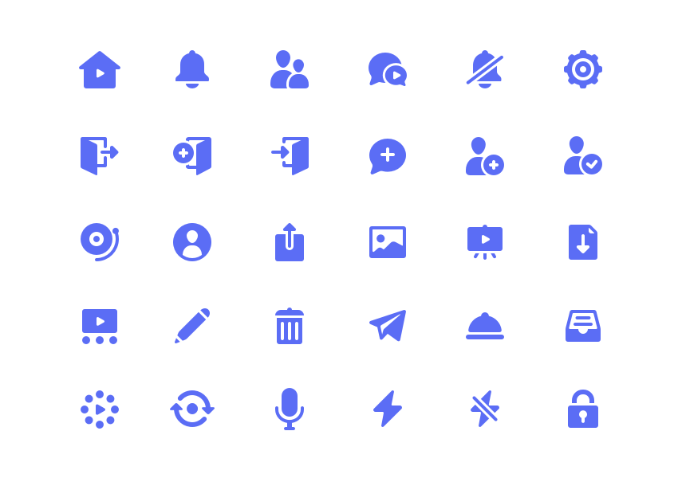

# 6. 아이콘 디자인하기

> [!NOTE]  
> 이 문서에서는 아이콘을 직접 그릴 수 있도록 아이콘 디자인 규칙과 좋은 예시/나쁜 예시를 소개합니다.

## 6.1. 아이콘 디자인의 기본 규칙

- **간결성:** 아이콘은 작고 단순한 크기에서도 명확하게 인식되어야 하므로 불필요한 디테일을 줄입니다.
- **일관성:** 동일한 프로젝트 내에서는 선 두께, 스타일, 각도 등이 일관되게 유지되어야 합니다.
- **명확성:** 사용자가 즉각적으로 의미를 이해할 수 있어야 합니다.
- **크기 최적화:** 일반적으로 16px ~ 64px 크기에서 잘 보이도록 디자인합니다.
- **단색 또는 제한된 색상 사용:** 아이콘은 주로 단색으로 표현하며, 필요 시 브랜드 컬러를 최소한으로 사용합니다.
- **벡터 기반 디자인:** SVG 등 벡터 포맷으로 제작하여 크기 조절 시 품질 저하를 방지합니다.
- **격자 맞춤:** 아이콘을 그릴 때는 1픽셀 단위의 격자(grid)에 정확히 맞추어 그려야 하며, 소수점 좌표를 피해야 합니다.  
  소수점 좌표가 포함되면 PNG 등의 이미지 내보내기 시 아이콘이 깨지고 흐릿해질 수 있습니다.
- **시각적 밸런스:** 동일한 크기라도 형태에 따라 시각적으로 커 보이거나 작아 보일 수 있으니, 적절한 여백과 크기 조절로 균형을 맞추는 것이 중요합니다.
- **이미지 출력 시 주의:** 아이콘을 SVG로만 사용하지 않고 PNG 등 이미지로 내보낼 경우, 1배수, 2배수 등 배수 단위로 깨지지 않게 내보내야 하며, 선명도를 위해 격자에 정확히 맞춘 디자인이 필수입니다.

## 6.2. 좋은 아이콘 예시

- 선과 도형이 명확하고 간결함.
- 모든 아이콘이 동일한 스타일과 두께를 유지.
- 아이콘의 의미가 직관적이고 쉽게 이해 가능.
- 적절한 여백과 균형이 맞춰져 있음.
- 1픽셀 격자에 정확히 맞춰져 있어 이미지 내보내기 시 깨지지 않음.

## 6.3. 나쁜 아이콘 예시

- 너무 복잡하거나 디테일이 과한 아이콘.
- 선 두께가 일정하지 않아 시각적으로 불균형.
- 아이콘의 의미가 불분명하거나 혼동을 줄 수 있음.
- 크기가 작아졌을 때 인식하기 어려움.
- 소수점 좌표를 사용하여 이미지 내보내기 시 픽셀이 흐려지거나 깨짐.
- 격자에 맞지 않아 라인이 찌그러지거나 비뚤어짐.

## 6.4. 아이콘 제작 시 유용한 팁

- **그리드 활용:** Figma, Illustrator 등에서 24x24, 32x32 픽셀 격자를 켜고 작업해 정렬과 비율을 맞춥니다.
- **Boolean Operation:** 도형 합치기, 빼기 기능으로 복잡한 모양을 쉽게 만듭니다.
- **Outline Stroke:** 선을 윤곽선으로 변환해 세밀한 조정이 가능.
- **픽셀 단위 조정:** 좌표와 크기 값을 모두 정수 단위로 맞춰 이미지 내보낼 때 깨짐을 방지합니다.
- **시각적 밸런스 보정:** 원이나 사각형 같은 기본 도형은 크기와 여백을 미세하게 조정해 시각적으로 균형 잡힌 아이콘을 만듭니다.
- **반복 작업:** 자주 사용하는 아이콘은 컴포넌트로 만들어 재사용성과 유지관리를 용이하게 합니다.
- **다양한 크기 테스트:** 16px, 24px, 32px, 64px 등 여러 크기에서 아이콘이 어떻게 보이는지 꼭 확인하세요.
- **이미지 내보내기 시 배수 설정:** 특히 PNG로 내보낼 땐 1배수, 2배수 등으로 내보내 선명도를 유지합니다.

> [!TIP]  
> 아이콘은 작은 크기에서도 명확하게 전달되어야 하므로, 여러 크기에서 테스트하며 최적화하는 것이 매우 중요합니다.  
> 또한, 단순히 ‘예쁘게’ 그리는 것이 아니라, 픽셀 단위로 정확하게 맞추는 정밀함이 아이콘의 완성도를 좌우합니다.
