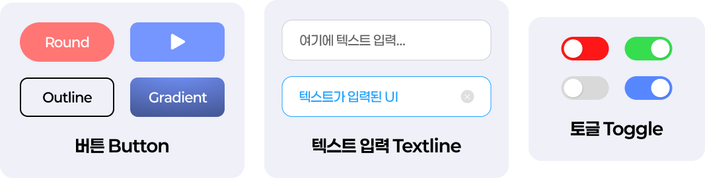
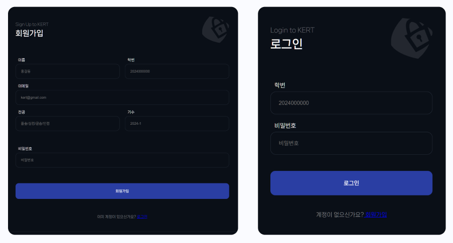

# 7. 재사용 가능한 디자인

> [!NOTE]  
> 이 문서에서는 디자인 재사용성에 대해 배우고 예시를 통해 재사용성의 중요함을 설명합니다.

## 7.1. 재사용 가능한 디자인이란?

- **정의:** 한 번 만든 디자인 요소를 여러 곳에서 반복해서 사용할 수 있도록 설계하는 것.
- **목적:** 디자인 작업 효율성 증가, 일관성 유지, 수정 시 빠른 반영.
- **예시:** 버튼, 아이콘, 색상 팔레트, 폰트 스타일 등.

## 7.2. Figma에서 재사용성 지원 기능

- **컴포넌트(Component):** 자주 사용하는 UI 요소를 컴포넌트로 만들어 재사용. 컴포넌트 수정 시 모든 인스턴스에 자동 반영.
- **스타일(Styles):** 색상, 텍스트, 효과 스타일을 저장해 프로젝트 내 일관된 디자인 적용.
- **라이브러리(Library):** 컴포넌트와 스타일을 팀과 공유해 협업 및 통일된 디자인 유지.

## 7.3. 재사용성의 중요성

- **일관성 유지:** 사용자 경험을 향상시키고 브랜드 아이덴티티를 강화.
- **시간 절약:** 반복 작업 감소로 빠른 디자인 완성 가능.
- **유지보수 용이:** 디자인 변경 시 한 곳만 수정하면 전체에 반영.
- **협업 효율성:** 팀원 간 동일한 디자인 자산을 공유하며 작업 혼선 감소.

> [!TIP]  
> 재사용 가능한 디자인 요소를 적극 활용하면 프로젝트 규모가 커져도 디자인 품질과 효율성을 유지할 수 있습니다.

## 7.4. 재사용성 향상을 위한 실습 예시

> [!NOTE]  
> [컴포넌트](./10-Component.md)와 연계하여 실습을 진행합니다.
