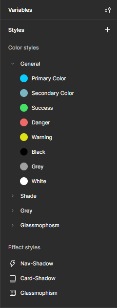
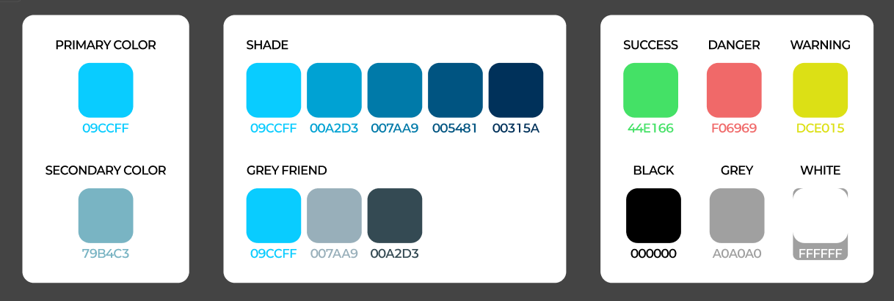

# 8. 전역 스타일

> [!NOTE]  
> 이 문서에서는 [재사용 가능한 디자인](./07-Reusable-Design.md)과 연계하여 전역 스타일에 대해 설명하고 Figma에서 전역 스타일을 생성하는 법을 안내합니다.

## 8.1. 전역 스타일이란?

- **정의:** 프로젝트 내에서 공통으로 사용하는 색상, 텍스트, 효과 스타일 등을 하나로 묶어 관리하는 디자인 자산입니다.
- **목적:** 디자인 일관성 유지와 변경 시 효율적 반영.
- **예시:** 브랜드 메인 컬러, 버튼 텍스트 스타일, 그림자 효과 등.

## 8.2. 전역 스타일의 장점

- **일관된 디자인 유지:** 모든 컴포넌트와 페이지에서 동일한 스타일 적용.
- **수정 용이:** 스타일을 변경하면 관련된 모든 요소에 자동으로 업데이트.
- **협업 효율화:** 팀원 간 동일한 스타일을 공유해 혼선을 줄임.

## 8.3. Figma에서 전역 스타일 생성하기

### 1) 색상 스타일 생성

- 색상 패널에서 원하는 색상 선택.
- ‘+’ 버튼 클릭 후 ‘Create style’ 선택.
- 스타일 이름을 명확하게 지정 (예: Primary / Secondary / Background 등).

### 2) 텍스트 스타일 생성

- 텍스트 레이어 선택 후 폰트, 크기, 자간, 줄간격 등 설정.
- 우측 속성 패널의 텍스트 스타일 섹션에서 ‘+’ 버튼 클릭.
- 이름 지정 후 저장.

### 3) 효과 스타일 생성

- 레이어에 그림자, 블러 등 효과 적용.
- 효과 패널에서 ‘+’ 버튼 클릭 후 스타일 생성 및 이름 지정.

## 8.4. 전역 스타일 적용과 관리

- 컴포넌트나 오브젝트의 색상, 텍스트, 효과를 선택 시 저장된 전역 스타일 목록에서 바로 적용 가능.
- 스타일 변경 시 ‘Update style’ 기능을 통해 전체에 일괄 반영.
- 스타일 삭제나 이름 변경도 전역 스타일 패널에서 관리.

> [!TIP]  
> 프로젝트 초기에 전역 스타일을 체계적으로 설정하면 작업 효율과 디자인 퀄리티를 크게 높일 수 있습니다.
