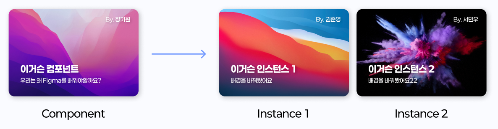

# 10. 컴포넌트

> [!NOTE]  
> 이 문서에서는 컴포넌트가 무엇인지, 사용하는 이유, Figma에서 컴포넌트를 만드는 법, 컴포넌트와 인스턴스에 대해 설명합니다.

## 10.1. 컴포넌트란?

- 컴포넌트(Component)는 버튼, 입력창, 카드 등 **UI 디자인에서 반복적으로 사용되는 요소를 하나의 모듈로 정의**한 것입니다.
- 반복되는 요소를 컴포넌트화하면 **디자인의 일관성을 유지**할 수 있고, 변경 시 **한 번에 전체 수정**이 가능합니다.

### 컴포넌트 예시

- 버튼(Button)
- 입력창(Input Field)
- 체크박스(Checkbox)
- 라디오 버튼(Radio Button)
- 드롭다운(Dropdown)
- 모달(Modal)
- 카드(Card)

## 10.2. 컴포넌트를 사용하는 이유

| 이유               | 설명                                                            |
| ------------------ | --------------------------------------------------------------- |
| **일관성 유지**    | 디자인 시스템 내에서 스타일, 간격, 색상 등을 동일하게 적용 가능 |
| **빠른 수정**      | 하나의 컴포넌트를 수정하면 연결된 모든 인스턴스에 자동 반영됨   |
| **작업 효율 증가** | 매번 새로 만들 필요 없이 인스턴스로 불러와 배치 가능            |
| **협업 편의성**    | 디자이너와 개발자 간 명확한 컴포넌트 기준으로 협업 가능         |

## 10.3. 컴포넌트와 인스턴스

- **컴포넌트:** 원본 요소 (예: 템플릿)
- **인스턴스:** 컴포넌트를 복제한 것. 전체 스타일은 컴포넌트를 따라가며, 일부 요소만 개별 수정 가능.

> [!TIP]  
> 컴포넌트를 수정하면 모든 인스턴스에 **자동 반영**되어 유지보수에 매우 유리합니다.

## 10.4. Figma에서 컴포넌트 만드는 법

> 같이 간단한 썸네일을 만들어봐요

1. 여러 개의 오브젝트(텍스트, 도형 등)를 **선택**합니다.
2. `Ctrl/Cmd + Alt + K` 또는 마우스 우클릭 > `Create component` 선택.
3. 좌측 레이어 트리에 컴포넌트 아이콘이 생기고, 인스턴스 복사가 가능해집니다.
4. 이후 이 컴포넌트는 `Assets` 패널에서도 확인 가능하며, 어디서든 드래그해 사용할 수 있습니다.

## 10.5. Variants 기능 소개

Figma에서는 `Variants`를 활용하여 하나의 컴포넌트에 여러 상태를 설정할 수 있습니다. (예: 버튼 컴포넌트 → 기본, Hover, Disabled 상태 통합)

> [!NOTE]  
> Variants는 `Component Set`으로 묶이며, 개발자 전달에도 유용한 구조를 제공합니다. [Component Set](./11-Component-Set.md)에서 연계하여 설명/응용합니다.

## 10.6. 정리

| 개념          | 설명                                                   |
| ------------- | ------------------------------------------------------ |
| **Component** | 디자인의 원본 요소 (수정하면 전체 인스턴스 반영)       |
| **Instance**  | 컴포넌트를 복제한 개별 요소 (부분 수정 가능)           |
| **Variants**  | 하나의 컴포넌트에 다양한 상태를 통합하여 구성하는 기능 |

> [!TIP]  
> 디자인을 처음부터 반복해서 만들지 마세요!  
> 컴포넌트를 잘 정의해두면 훨씬 효율적인 작업이 가능합니다.
