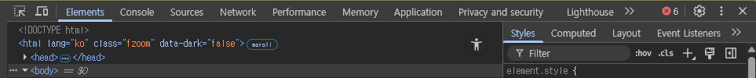
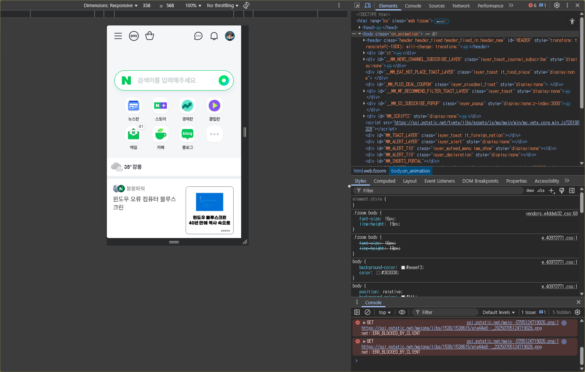

# 5. 웹 브라우저 개발자 도구

> [!NOTE]  
> 이 문서에서는 웹 브라우저의 개발자 도구를 활용하여 HTML/CSS 구조를 분석하고, 실시간으로 수정해보는 방법을 안내합니다.

## 5.1. 개발자 도구란?

- 웹 브라우저(Chrome, Edge 등)에서 제공하는 **내장 도구**로, 웹사이트의 구조, 스타일, 동작 등을 실시간으로 확인하고 수정할 수 있습니다.
- 디자이너와 개발자 모두에게 필수적인 웹 분석 도구입니다.

> [!TIP]  
> 가장 많이 사용하는 브라우저는 **Chrome**이며, 대부분의 기능은 다른 브라우저와 유사합니다.

## 5.2. 개발자 도구 열기

| 방법          | 설명                                                        |
| ------------- | ----------------------------------------------------------- |
| 단축키        | **F12** 또는 **Ctrl + Shift + I** (Mac: `Cmd + Option + I`) |
| 마우스 우클릭 | 페이지에서 **오른쪽 클릭 → 검사(Inspect)** 선택             |
| 메뉴 이용     | 브라우저 메뉴 → 도구 더보기 → 개발자 도구                   |

  
<strong>Question</strong>

  
단축키로 여는 것과 우클릭 후 검사로 여는 것은 무슨 차이가 있을까요?

## 5.3. 주요 기능 소개

| 패널               | 설명                                                                              |
| ------------------ | --------------------------------------------------------------------------------- |
| **Elements**       | 현재 페이지의 HTML 구조와 CSS 스타일 확인 및 실시간 편집 가능                     |
| **Styles**         | 선택한 요소의 스타일을 확인 및 수정                                               |
| **Console**        | 오류 메시지 확인, JavaScript 코드 직접 실행                                       |
| **Network**        | 페이지에 로딩되는 파일, 속도, 순서 등을 확인                                      |
| **Device Toolbar** | 모바일/태블릿/데스크탑 등 다양한 화면에서 반응형 테스트 가능 (`Ctrl + Shift + M`) |

## 5.4. 실습 예시

### HTML 구조 확인 및 수정

1. 웹 페이지에서 원하는 텍스트에 마우스 우클릭 → **검사(Inspect)** 클릭
2. 좌측 `Elements` 탭에서 해당 HTML 태그가 자동으로 선택됩니다.
3. 해당 텍스트를 더블 클릭하여 내용을 직접 수정해보세요. → 실제 화면에 즉시 반영됨 (임시 변경)

### CSS 실시간 수정 및 추가

1. `Elements` 탭 우측 `Styles` 영역에서 해당 태그의 스타일 속성 확인
2. `color`, `font-size`, `margin` 등을 수정해보며 디자인을 실시간 변경
3. 새 속성을 추가하려면 빈 줄에 `background-color: yellow;`와 같이 입력

> [!TIP]  
> 실제 파일은 바뀌지 않지만, 빠르게 실험하고 확인할 수 있는 **디자인 테스트용 도구**로 매우 유용합니다!

## 5.5. 반응형 테스트

- 개발자 도구 왼쪽 상단의 📱 아이콘 클릭 (또는 단축키 `Ctrl + Shift + M`)
- 다양한 기기(iPhone, iPad, Galaxy 등) 해상도를 선택하여 **디자인이 어떻게 보이는지 테스트 가능**
- 창 크기를 자유롭게 조절하면서 **반응형 디자인 확인**

## ✅ 요약

| 기능           | 설명                         |
| -------------- | ---------------------------- |
| Elements       | HTML/CSS 구조 확인 및 편집   |
| Styles         | CSS 속성 실시간 편집         |
| Device Toolbar | 반응형 뷰 테스트             |
| Console        | JavaScript 에러 확인 및 실행 |
| Network        | 페이지 로딩 파일/속도 분석   |

> [!TIP]  
> 디자이너가 만든 결과물을 브라우저에서 직접 테스트하고 피드백 주고받을 때 매우 유용합니다.  
> Figma에서 만든 시안을 코드로 구현할 때도 **실시간으로 수정 테스트**하는 데 효과적입니다.
