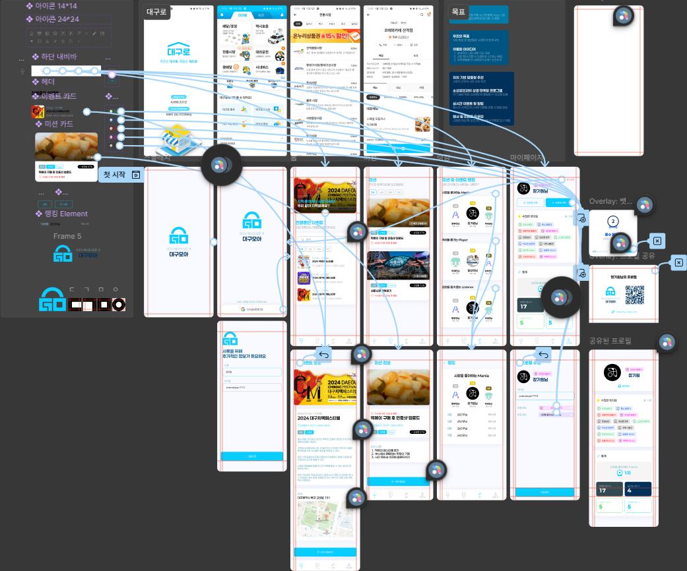

# 5. 프로토타입과 플로우

> [!NOTE]  
> 이 문서에서는 Figma에서 프로토타입을 만드는 방법과 사용자 흐름(Flow)을 설정하는 방법을 설명합니다.

## 5.1. 프로토타입이란?

- **프로토타입(Prototype)**은 실제 서비스를 개발하지 않고도 **사용자의 동작을 시뮬레이션**할 수 있도록 인터랙션을 정의한 시제품입니다.
- 화면 간 이동이나 버튼 클릭 등의 상호작용을 직접 체험해볼 수 있어, 개발 전 사용성 테스트 및 피드백 수집에 매우 유용합니다.

### 프로토타입의 장점

| 장점                          | 설명                                       |
| ----------------------------- | ------------------------------------------ |
| **실제 사용 시나리오 테스트** | 사용자 입장에서 UI 흐름을 경험해볼 수 있음 |
| **빠른 피드백 수집**          | 개발 이전 단계에서 수정사항 파악 가능      |
| **개발 커뮤니케이션 원활화**  | 디자이너-개발자 간 동작 이해 공유 가능     |

## 5.2. Figma에서 프로토타입 만들기

### 프로토타입 모드로 진입

- 오른쪽 상단 탭에서 **`Prototype`** 탭 클릭 → 파란색 연결 핸들이 활성화됨

### 화면 연결하기

- 연결하려는 요소(예: 버튼)를 클릭 → 파란색 핸들을 다음 화면(프레임)으로 드래그

### 인터랙션 설정

- 연결 선을 클릭하면 오른쪽 패널에서 다음 옵션 설정 가능:

| 항목            | 설명                                                             |
| --------------- | ---------------------------------------------------------------- |
| **Interaction** | 트리거 방식: `On Click`, `While Hovering`, `After Delay` 등      |
| **Navigation**  | 이동 방식: `Navigate to`, `Open Overlay`, `Scroll to`, `Back` 등 |
| **Animation**   | 전환 효과: `Instant`, `Dissolve`, `Slide In`, `Smart Animate` 등 |

### 시작 프레임 설정

- 프로토타입 시작 지점을 지정하려면 해당 프레임 선택 후 오른쪽 상단의 ▶️ 아이콘 클릭  
  → `"Set as Starting Frame"` 설정

## 5.3. Flow(플로우) 설정

- **플로우(Flow)**는 프로토타입 내에서 특정 사용자 시나리오를 나타내는 흐름입니다.
- 여러 개의 플로우를 구성할 수 있어, 다양한 사용 시나리오를 동시에 테스트할 수 있습니다.

### 💡 플로우 구성 예시

| Flow 이름     | 설명                                     |
| ------------- | ---------------------------------------- |
| 로그인 Flow   | 로그인 화면 → 메인 화면                  |
| 회원가입 Flow | 시작 화면 → 약관 동의 → 정보 입력 → 완료 |
| 쇼핑 Flow     | 홈 → 상품 클릭 → 장바구니 → 결제         |

- 각 Flow는 Figma의 **프레젠테이션 모드에서 개별 시나리오로 실행** 가능

## 5.4. 프로토타입 실행 및 공유

- 상단 오른쪽의 ▶️ 버튼 클릭 → 새 탭에서 프로토타입 미리보기 실행
- 오른쪽 상단 `Share` 버튼 클릭 → 링크 복사 후 다른 사람과 공유 가능
  - `Can View` 권한이면 프로토타입만 볼 수 있음
  - `Can Edit` 권한이면 수정 가능

## ✅ 요약

| 개념             | 설명                                                      |
| ---------------- | --------------------------------------------------------- |
| **프로토타입**   | 화면 간 인터랙션을 설정해 실제처럼 동작하도록 만든 시제품 |
| **인터랙션**     | 클릭, 호버 등의 동작과 전환 애니메이션                    |
| **플로우(Flow)** | 특정 사용자 행동 경로를 구성한 흐름                       |
| **공유**         | 실행 링크 생성 및 권한 설정을 통한 외부 공유              |

> [!TIP]  
> 실무에서는 개발자와의 협업을 위해 프로토타입 링크 공유가 필수이며, 프로토타입 설명 주석이나 Flow 이름을 명확히 설정하는 것이 중요합니다.