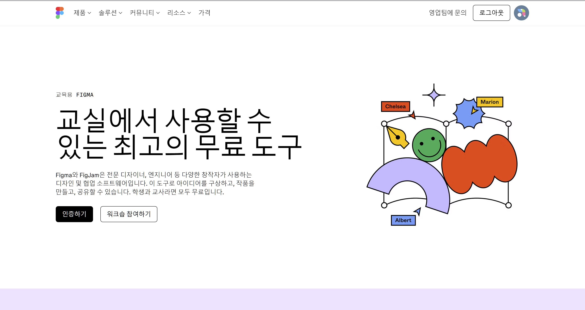
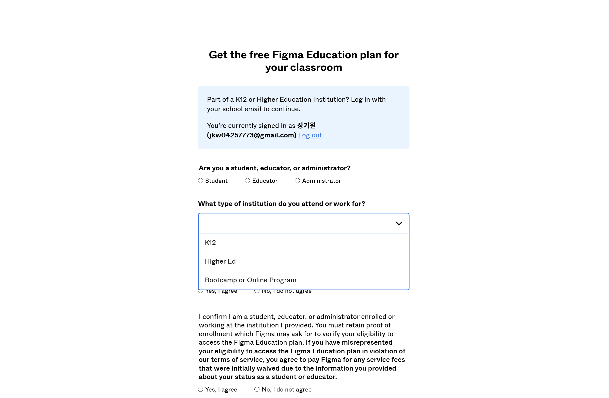

# 01. Figma 학생 인증으로 유료 기능 활성화하기

> [!NOTE]
> 이 문서는 Figma의 유료 기능을 학생 계정으로 활성화하는 방법을 안내합니다.

## 1.1. Figma Education 계정의 이점

Figma는 교육 목적으로 학생 및 교사에게 유료 기능을 무료로 제공합니다. 이를 통해 더 많은 기능과 협업 도구를 활용할 수 있습니다.

- **무제한 Team 파일**: 일반 무료 계정은 3개의 Team 파일로 제한되지만, 교육 계정은 무제한으로 파일을 생성할 수 있습니다.
- **무제한 버전 기록**: 디자인 변경 사항을 무제한으로 저장하고 되돌릴 수 있습니다.
- **팀 프로젝트**: 여러 명이 함께 작업하는 팀 프로젝트를 여러개 생성하고 관리할 수 있습니다.
- **고급 프로토타이핑 기능**: 더 복잡하고 인터랙티브한 프로토타입을 만들 수 있습니다.

## 1.2. 학생 인증 절차

Figma Education 계정을 활성화하려면 다음 단계를 따릅니다.

1.  **Figma 계정 생성**: 아직 Figma 계정이 없다면, [Figma 웹사이트](https://www.figma.com/)에서 계정을 생성합니다.
2.  **교육 계정 신청 페이지 접속**: [Figma Education](https://www.figma.com/ko-kr/education/) 신청 페이지로 이동합니다. (일반적으로 Figma 설정 내에서 Education 탭을 찾을 수 있습니다.)
3.  **학생 유형 선택**: 고등학생은 K1, 대학생은 고등교육 또는 Higher Ed를 선택합니다.
4.  **학교 이메일 주소로 로그인/회원가입**: 학교에서 발급받은 이메일 주소로 로그인 또는 회원가입을 합니다.
5.  **학생 신분 증명**: 학생증, 재학 증명서 등 학생 신분을 증명할 수 있는 서류를 업로드합니다. (Figma에서 요구하는 형식에 맞춰 제출)
6.  **인증 완료**: 고등학생의 경우 추가 서류 없이 사용이 가능하고, 대학생은 입학 증명서가 필요하지만 기본적으로 이메일의 도메인으로 학생 신분을 검증합니다.

> [!TIP]
> 즉, 학교 이메일 주소를 사용하면 승인 절차가 간편하게 진행될 수 있습니다.

## 1.3. 유료 기능 활용

학생 인증이 완료되면 Figma의 모든 유료 기능을 무료로 사용할 수 있습니다. 이를 통해 더욱 심화된 UI/UX 디자인 학습과 실습이 가능해집니다.

- **팀 프로젝트 생성**: 팀원들과 함께 실시간으로 디자인 작업을 진행할 수 있습니다.
- **디자인 시스템 구축**: [Day 3: 재사용 가능한 디자인](/day_3/07-Reusable-Design.md)에서 배운 내용을 바탕으로, 팀 프로젝트에서 활용할 디자인 시스템을 구축하고 관리할 수 있습니다.
- **변수 타입 지정**: [08. Figma 변수 타입(Generics) 활용하기](./08-Figma-Variable-Types.md)에서 사용할 변수 타입을 무료로 사용할 수 있습니다. (기존은 유료 기능)

> [!NOTE]
> 대부분 Professional 플랜의 유료 기능을 사용할 수 있습니다
