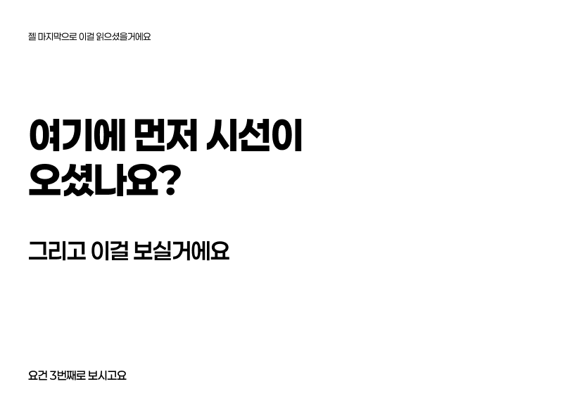
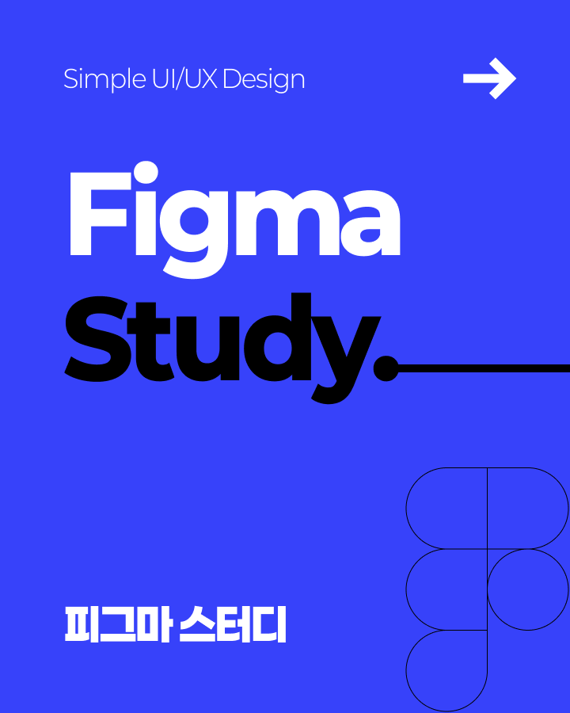
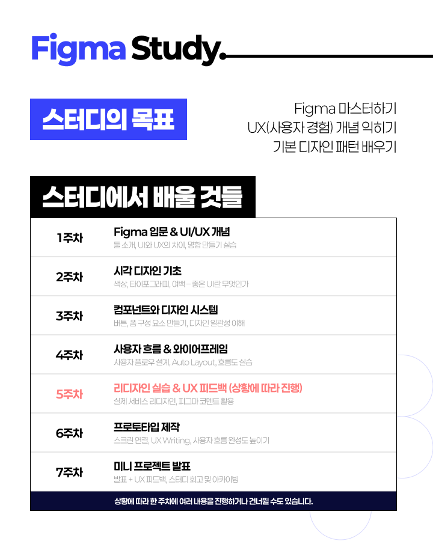

# 04. 시각적 계층 구조 잡기

> [!NOTE]
> 이 문서는 디자인에서 시각적 계층 구조를 효과적으로 구축하는 심화된 방법을 다룹니다. [Day 2: 시각적 계층 구조](./../day_2/04-Visual-Hierarchy.md)의 내용을 바탕으로 합니다.

## 4.1. 시각적 계층 구조의 재정의

시각적 계층 구조(Visual Hierarchy)는 디자인 요소들의 중요도에 따라 시각적인 우선순위를 부여하여 사용자의 시선이 자연스럽게 흐르도록 유도하는 것을 의미합니다. 이는 정보의 이해도를 높이고, 사용자가 원하는 정보를 빠르게 찾을 수 있도록 돕습니다.

## 4.2. 시각적 계층 구조를 위한 고급 기법

### 4.2.1. 크기 (Size)

가장 중요하거나 먼저 보여야 할 요소는 더 크게 만듭니다. 제목, 핵심 메시지 등에 적용하여 시선을 즉시 사로잡습니다.

### 4.2.2. 색상 (Color)

대비되는 색상이나 강조색을 사용하여 특정 요소를 돋보이게 합니다. [Day 2: 컬러 팔레트](./../day_2/03-Color-Pallete.md)에서 배운 색상 이론을 활용하여 시각적 강도를 조절합니다.

### 4.2.3. 대비 (Contrast)

색상, 크기, 모양, 질감 등 다양한 요소에서 대비를 주어 시각적 흥미를 유발하고 중요도를 강조합니다. 높은 대비는 중요한 정보를, 낮은 대비는 보조적인 정보를 나타낼 수 있습니다.

### 4.2.4. 공간 (Space / Proximity)

관련 있는 요소들은 가깝게 배치하고, 관련 없는 요소들은 멀리 떨어뜨려 그룹화합니다. 이는 정보의 구조를 명확히 하고 가독성을 높입니다. [Day 2: 여백의 미](./../day_2/02-The-Beauty-of-the-Blank.md)를 적극 활용합니다.

### 4.2.5. 정렬 (Alignment)

요소들을 일관된 방식으로 정렬하여 질서 있고 깔끔한 느낌을 줍니다. 이는 시각적 흐름을 만들고 디자인의 전문성을 높입니다.

### 4.2.6. 반복 (Repetition)

특정 스타일이나 패턴을 반복하여 일관성을 유지하고, 중요한 요소들을 강조합니다. 이는 사용자가 디자인 패턴을 학습하고 예측 가능하게 만듭니다.

### 4.2.7. 방향 (Direction)

선, 화살표, 시선의 방향 등을 활용하여 사용자의 시선을 특정 방향으로 유도합니다. 이는 정보의 흐름을 안내하는 데 효과적입니다.

    
    
    

## 4.3. 실전 적용 팁

- **F-패턴/Z-패턴**: 사용자들이 웹 페이지를 스캔하는 일반적인 패턴을 이해하고, 중요한 정보를 이 패턴에 맞춰 배치합니다. [참고](https://designbase.co.kr/dictionary/f-pattern-and-z-pattern/)
- **아이캐칭 요소**: 페이지 로딩 시 가장 먼저 시선을 사로잡을 요소를 전략적으로 배치합니다.
- **점진적 공개**: 모든 정보를 한 번에 보여주기보다, 중요한 정보부터 점진적으로 공개하여 사용자의 인지 부하를 줄입니다. (눈과 뇌에게 쉬는 시간을 주기!)

> [!TIP]
> 시각적 계층 구조는 사용자가 디자인을 '읽는' 방식을 결정합니다. 효과적인 계층 구조는 사용자가 길을 잃지 않고 원하는 정보를 찾을 수 있도록 돕는 지도와 같습니다.
