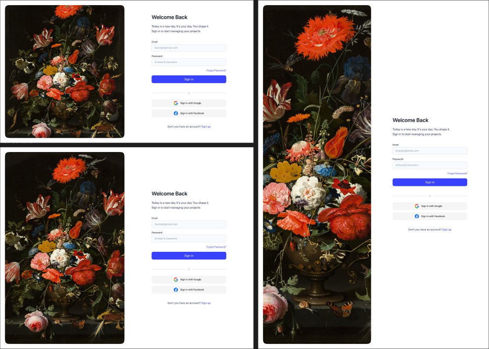

# 06. 실습 1: Auto Layout 연습

> [!NOTE]
> 이 문서는 Figma의 Auto Layout 기능을 직접 실습해보는 가이드입니다. [Auto Layout을 적용해야하는 이유](./05-Why-Auto-Layout.md)에서 배운 내용을 바탕으로 진행됩니다.

## 6.1. 기본 Auto Layout 적용하기

### 목표

1. 화면(Frame) 사이즈에 따라 자동적으로 정렬되야합니다.
2. 항상 사진은 화면(Frame)의 절반을 차지합니다.
3. 요소 간 계층 구조를 잡아주세요.

### 컴포넌트로 만들어야할 것

1. 입력폼
2. 버튼
3. 소셜 로그인 버튼
