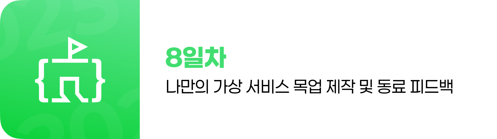

### 8일차: Figma 기반 웹 포트폴리오 제작 (2일차) 및 발표

- **1교시: 포트폴리오 CSS 레이아웃 및 반응형 디자인**

  - **HTML/CSS로 Figma로 디자인한 UI 만들기**: CSS Flexbox, Grid를 활용한 레이아웃 완성, Figma 디자인에 기반한 반응형 웹 디자인 적용 (미디어 쿼리)
  - **AI를 활용하되 의존하지 않도록**: AI에게 반응형 레이아웃 구현 방법, 미디어 쿼리 예시 등 질문하여 학습에 활용

- **2교시: 애니메이션, 트랜지션, 웹폰트/아이콘 추가**

  - **HTML/CSS로 Figma로 디자인한 UI 만들기**: 애니메이션, 트랜지션 효과 추가 (Figma에서 계획한 인터랙션 구현), 웹폰트 및 아이콘 적용
  - **AI를 활용하되 의존하지 않도록**: AI에게 특정 애니메이션 구현 코드, 웹폰트 적용 방법 등 문의하여 효율적인 학습

- **3교시: 최종 점검 및 디버깅**

  - **HTML/CSS로 구현 전 필요한 기능 배우기**: 개발자 도구를 활용한 오류 검사 및 수정, 웹 표준 및 웹 접근성 준수 여부 확인, 최종 디자인과 코딩 일치 여부 확인
  - **AI를 활용하되 의존하지 않도록**: AI에게 오류 메시지 해석, 디버깅 방법 문의 등 문제 해결에 활용

- **4교시: Netlify 최종 배포 및 Git/GitHub 최종 업로드**

  - **HTML/CSS로 구현 전 필요한 기능 배우기**: 완성된 포트폴리오를 Netlify에 최종 배포 (지속적인 배포 확인)
  - **HTML/CSS로 구현 전 필요한 기능 배우기**: 학생별 브랜치에 최종 포트폴리오 결과물 업로드

- **5교시: 결과물 발표 및 시상**

  - 개인/조별 포트폴리오 결과물 발표 (각 팀/학생 5-10분 발표)
  - 강사 및 동료 수강생 간의 건설적인 피드백
  - **반마다 우수 학생 시상**
  - 향후 학습 방향 및 성장 가이드 제시
